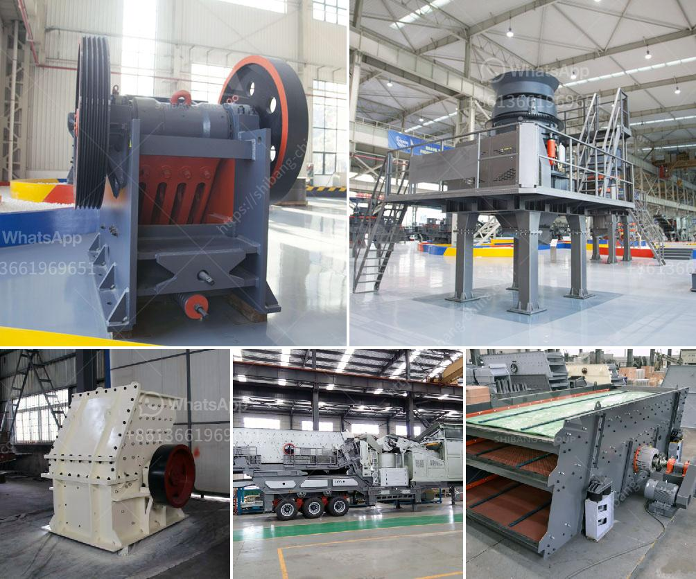

<h3>pebble crushing equipment</h3>
Pebble crushing equipment is a type of machine used to crush pebbles into smaller particles for various applications, such as construction, landscaping, and agriculture. These machines come in different sizes and configurations to meet the specific needs of the user.

Pebbles are small, smooth and round stones that can be found in riverbeds and beaches. They are commonly used for decorative purposes in gardens, parks, and driveways. However, they also have practical uses in construction projects. Crushed pebbles are often used as aggregate in concrete mixes and road construction as they provide strength, durability, and aesthetic appeal to the final product.

One of the primary machines used for pebble crushing is the cone crusher. The cone crusher uses a rotating cone that moves in an eccentric motion to crush the pebbles against the walls of the crushing chamber. This process is effective in producing finely crushed pebbles that can be used for various applications.

Cone crushers are available in different sizes and configurations to suit the specific needs of the user. Some cone crushers are designed for secondary crushing, while others are used for tertiary crushing. The choice of cone crusher depends on factors such as the size and hardness of the pebbles, desired product size, and production capacity.

Another commonly used machine for pebble crushing is the impact crusher. Impact crushers work by throwing the pebbles against a series of anvils or curtains to break them into smaller pieces. This process is effective in producing uniform-sized crushed pebbles for various applications. Impact crushers are often used in the construction and mining industries, where large quantities of pebbles need to be crushed efficiently.

In addition to cone crushers and impact crushers, there are other machines available for pebble crushing. These include jaw crushers, roll crushers, and hammer mills. Jaw crushers are used to crush larger pebbles into smaller particles, while roll crushers and hammer mills are mainly used for fine crushing.

When choosing a pebble crushing equipment, it is important to consider factors such as the desired product size, production capacity, power requirements, and maintenance requirements. It is also essential to select a machine that is robust and reliable to ensure uninterrupted operation and reduce downtime.

In conclusion, pebble crushing equipment plays a crucial role in various industries, including construction, landscaping, and agriculture. These machines are designed to crush pebbles into smaller particles for different applications. Cone crushers, impact crushers, jaw crushers, roll crushers, and hammer mills are some of the commonly used machines for pebble crushing. When selecting pebble crushing equipment, it is important to consider factors such as the desired product size and production capacity. By choosing the right machine, users can efficiently crush pebbles to meet their specific needs.
<h3>Contact us</h3><ul><li><strong>Whatsapp:&nbsp;<a href="https://wa.me/8613661969651">+8613661969651</a></strong></li><li><a href="https://swt.shibang-china.com/?git&amp;zhl&amp;pebble crushing equipment"><strong>Online Service(chat now)</strong></a></li></ul><h3>Related</h3><ul><li><a href='dolomite crushing machine for sale dubai.md'>dolomite crushing machine for sale dubai</a></li><li><a href='crushers for sale in uae.md'>crushers for sale in uae</a></li><li><a href='semi industrial stone crusher.md'>semi industrial stone crusher</a></li><li><a href='crusher plant in malaysia.md'>crusher plant in malaysia</a></li><li><a href='crushing plant working.md'>crushing plant working</a></li></ul>