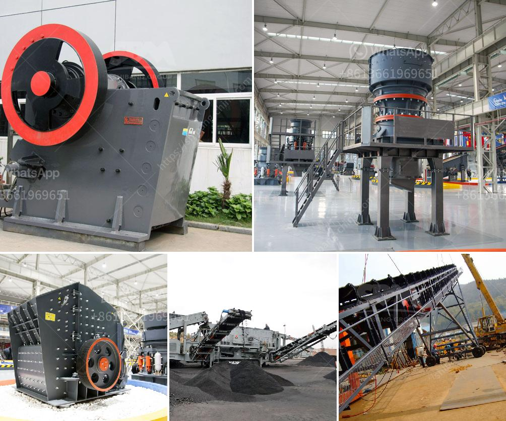

<h3>pebble crushing production line</h3>
Pebble crushing production line is a special production line for processing pebbles. Researchers have developed a series of professional equipment to crush pebbles of different sizes, providing an essential solution for high-quality aggregate production. 

The pebble crushing production line usually consists of vibrating feeder, jaw crusher, impact crusher or cone crusher, sand making machine, vibrating screen, sand washing machine, belt conveyor, centralized electric control, and other equipment. These machines work together to complete the production process and ensure the high efficiency and quality of the final product.

1. High efficiency: The production line utilizes advanced crushing technology, which greatly enhances the crushing efficiency. The pebbles are evenly crushed, ensuring the stability and uniformity of the finished product.

2. Excellent product quality: The production line is equipped with professional crushing equipment, ensuring that the pebbles are crushed into the ideal size and shape. This leads to high-quality aggregates that can be used in various construction projects.

3. Low production cost: The production line is highly automated, reducing the labor cost and improving production efficiency. Additionally, the advanced equipment is energy-efficient, resulting in lower power consumption and reduced operational costs.

4. Environmentally friendly: The production line is designed with noise reduction and dust removal measures, making it environmentally friendly and ensuring a clean working environment.

5. Wide application: The crushed pebbles can be used in various construction projects, such as road construction, building construction, landscaping, and more. The versatility of the pebble crushing production line makes it suitable for a wide range of applications.

In conclusion, the pebble crushing production line offers numerous advantages, including high efficiency, excellent product quality, low production cost, environmental friendliness, and wide application. Its implementation not only improves the efficiency and quality of aggregate production but also contributes to sustainable development in the construction industry.
<h3>Contact us</h3><ul><li><strong>Whatsapp:&nbsp;<a href="https://wa.me/8613661969651">+8613661969651</a></strong></li><li><a href="https://swt.shibang-china.com/?git&amp;zhl&amp;pebble crushing production line"><strong>Online Service(chat now)</strong></a></li></ul><h3>Related</h3><ul><li><a href='limestone crushing plant manufacturer.md'>limestone crushing plant manufacturer</a></li><li><a href='kaolin grinding mill.md'>kaolin grinding mill</a></li><li><a href='used rock crusher dealers in usa.md'>used rock crusher dealers in usa</a></li><li><a href='ball mill price mexico.md'>ball mill price mexico</a></li><li><a href='coal processing plant maintenance.md'>coal processing plant maintenance</a></li></ul>