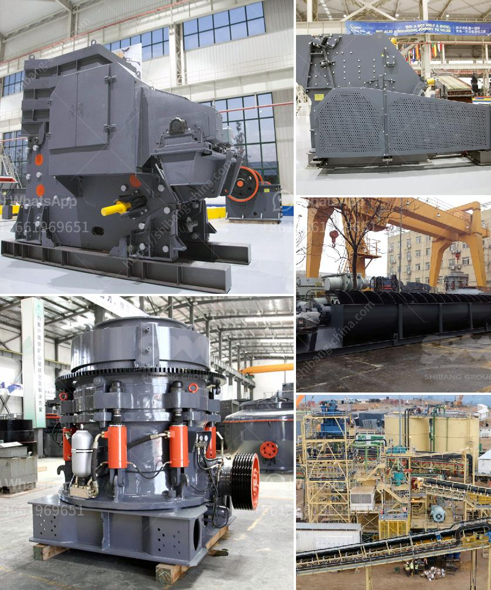

<h3>pebbles aggregate making machine</h3>
The construction industry is constantly evolving and adapting to new technologies that help streamline processes and increase efficiency. In this regard, the pebbles aggregate making machine has emerged as a game-changer. This innovative machine has revolutionized the way aggregates, specifically pebbles, are produced for construction projects.

Traditionally, aggregates were sourced from natural riverbeds, which could be a time-consuming and costly process. The need to transport bulky materials resulted in higher costs and negatively impacted the environment due to increased carbon emissions. However, the advent of pebbles aggregate making machines has changed the landscape of construction.

The machine efficiently crushes and shapes pebbles, transforming them into valuable aggregates of varying sizes. This offers construction companies a readily available and cost-effective option, eliminating the need for reliance on natural resources. Additionally, it significantly reduces transportation costs as the machine can be installed on-site, minimizing the distance aggregates need to travel.

Furthermore, the pebbles aggregate making machine ensures consistency in quality. The machine’s precise crushing and shaping capabilities produce aggregates that meet the required specifications for construction projects. This consistency directly translates into improved durability and strength of the final concrete products. Consequently, buildings and infrastructures constructed using these high-quality aggregates exhibit enhanced resistance to wear and tear, resulting in longer lifespans.

Another notable advantage of the pebbles aggregate making machine is its versatility. It can process a wide range of pebbles, including limestone, granite, basalt, and more. This versatility enables construction companies to cater to various project needs with ease, offering flexibility and adaptability. Moreover, the machine can be adjusted to produce aggregates of different sizes, ensuring it meets the unique requirements of each construction project.

In conclusion, the pebbles aggregate making machine has become a vital asset in the construction industry. Its ability to crush and shape pebbles efficiently, while maintaining consistency in quality, has transformed the way aggregates are sourced and used. By eliminating the reliance on natural resources and reducing transportation costs, this innovative machine is not only cost-effective but also environmentally friendly. With its versatility and ability to tailor the output to meet specific project needs, it has undoubtedly revolutionized the construction industry, paving the way for more sustainable and efficient practices.
<h3>Contact us</h3><ul><li><strong>Whatsapp:&nbsp;<a href="https://wa.me/8613661969651">+8613661969651</a></strong></li><li><a href="https://swt.shibang-china.com/?git&amp;zhl&amp;pebbles aggregate making machine"><strong>Online Service(chat now)</strong></a></li></ul><h3>Related</h3><ul><li><a href='small scale mining equipment price in zimbabwe.md'>small scale mining equipment price in zimbabwe</a></li><li><a href='jaw crusher 400 600.md'>jaw crusher 400 600</a></li><li><a href='calcium carbonate proses by process.md'>calcium carbonate proses by process</a></li><li><a href='distributor cone crusher indonesia.md'>distributor cone crusher indonesia</a></li><li><a href='gold mining equipment manufacturer china.md'>gold mining equipment manufacturer china</a></li></ul>