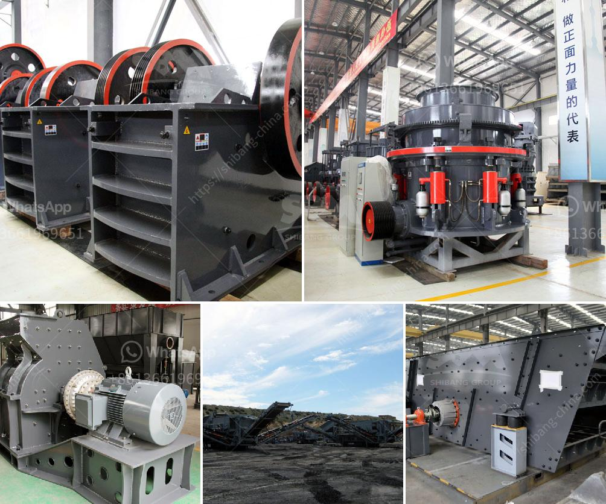

<h3>pf series impact crushers in alibaba</h3>
PF series impact crushers in Alibaba are the latest technology in the global crushing industry. They have been exported to over 90 countries and regions such as Southeast Asia, Africa, Europe, and the Americas, and have become one of the most popular crushers in the mining industry.

The PF series impact crushers are designed for crushing ores and rocks with particle size less than 500mm and compression strength less than 320MPa. They have a unique combination of heavy rotor design, wear material, and crushing chamber design, which enhances the crushing capacity and product quality.

One of the key features of the PF series impact crushers is their high reduction ratio. Compared to other crushers in the same category, these crushers can achieve a higher reduction ratio, resulting in a more efficient crushing process. This means that more material can be processed in a single pass, reducing the need for secondary crushing and saving both time and energy.

Another important feature of the PF series impact crushers is their versatility. These crushers can be used for both primary and secondary crushing applications, making them suitable for various types of materials and applications. Whether it is limestone, granite, basalt, or any other hard and abrasive material, the PF series impact crushers can handle it with ease.

In addition to their crushing capabilities, the PF series impact crushers also offer excellent cubicity of the end products. The unique shape of the crushing chamber and the rotor design ensure that the final products have a uniform shape and size distribution. This is particularly important for industries such as concrete production and asphalt recycling, where consistent product quality is crucial.

The PF series impact crushers are also equipped with advanced technological features to enhance their performance and reliability. These include a hydraulic opening mechanism, which allows for easy and quick access to the crushing chamber for maintenance and inspection. Additionally, the crushers are equipped with a comprehensive set of safety features to protect the operators and the equipment.

Alibaba is a leading online marketplace for international trade and has a wide range of suppliers offering PF series impact crushers. Buyers can browse through the product listings, compare prices and specifications, and contact suppliers directly to make inquiries or place orders. Alibaba also offers secure payment options, buyer protection, and logistics support, ensuring a smooth and hassle-free purchasing experience.

In conclusion, the PF series impact crushers in Alibaba are a reliable and efficient solution for crushing various types of materials. With their high reduction ratio, versatile applications, excellent cubicity of the end products, and advanced technological features, these crushers are a valuable asset for the mining industry. Buyers can find a wide range of options on Alibaba, making it easier than ever to find the perfect crusher for their needs.
<h3>Contact us</h3><ul><li><strong>Whatsapp:&nbsp;<a href="https://wa.me/8613661969651">+8613661969651</a></strong></li><li><a href="https://swt.shibang-china.com/?git&amp;zhl&amp;pf series impact crushers in alibaba"><strong>Online Service(chat now)</strong></a></li></ul><h3>Related</h3><ul><li><a href='sand making machine price.md'>sand making machine price</a></li><li><a href='diagram of stone crusher operation.md'>diagram of stone crusher operation</a></li><li><a href='ball mill calcium carbonat.md'>ball mill calcium carbonat</a></li><li><a href='pulverizer machines manufacturers.md'>pulverizer machines manufacturers</a></li><li><a href='flsmidth cement plant in egypt.md'>flsmidth cement plant in egypt</a></li></ul>