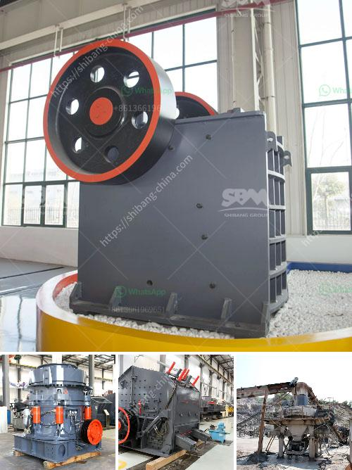

<h3>pharma grade kaolin process</h3>
Kaolin, also known as china clay, is a naturally occurring clay mineral widely used in various industries. One such industry that extensively relies on kaolin is the pharmaceutical industry, where it is processed into pharma grade kaolin to enhance the quality, purity, and effectiveness of medicinal products.

Pharma grade kaolin refers to the highest quality of kaolin specifically processed and refined to meet the stringent requirements of pharmaceutical applications. The process involves several crucial steps to ensure the removal of impurities and to achieve the desired properties for pharmaceutical uses.

The first step in the process is mining the kaolin deposits. These deposits are usually found in large open-pit mines in locations rich in kaolin, such as the United States, Brazil, the United Kingdom, and China. The kaolin ore is carefully extracted and transported to the processing facility for further refinement.

Once at the processing facility, the ore goes through a series of steps to remove impurities and enhance its purity. The ore is crushed into small particles and mixed with water to form a slurry. This slurry is then subjected to various processes such as classification, sedimentation, and filtration to separate the impurities from the kaolin.

One of the critical processes involved in obtaining pharma grade kaolin is centrifugation. Centrifuges are used to separate the finer, more desirable particles from the coarser impurities. This step ensures that the kaolin meets the strict particle size distribution requirements necessary for pharmaceutical applications.

Another vital aspect of the process is the removal of heavy metals, which could adversely affect the quality and safety of medicinal products. Various purification techniques, such as acid leaching, are employed to eliminate heavy metals, ensuring the purity of the resulting pharma grade kaolin.

After purification, the kaolin undergoes a drying process to remove excess moisture. The drying process helps to stabilize and prevent microbial growth while preparing the kaolin for further processing into different pharmaceutical forms, such as powders, suspensions, or tablets.

The final step in the pharma grade kaolin process involves testing and quality control. Several tests are conducted to ensure that the kaolin meets the high standards required for pharmaceutical applications. These tests include particle size analysis, chemical composition analysis, microbial testing, and heavy metal analysis, among others. The results of these tests determine the suitability of the pharma grade kaolin for various pharmaceutical formulations and applications.

The use of pharma grade kaolin in medicinal products offers several advantages. The high purity of pharma grade kaolin ensures the absence of harmful contaminants, making it safer for human consumption. The particle size distribution and physical properties of pharma grade kaolin can enhance the stability, flowability, and consistency of pharmaceutical formulations. Additionally, pharma grade kaolin can act as an excipient, helping to improve the overall performance and effectiveness of pharmaceutical products.

In conclusion, the pharma grade kaolin process plays a crucial role in enhancing the quality, purity, and effectiveness of medicinal products. The process involves mining, refining, purifying, drying, and testing to obtain the highest quality kaolin suitable for pharmaceutical applications. Pharma grade kaolin not only ensures the safety of medicinal products but also contributes to their improved stability and performance, making it an essential ingredient in the pharmaceutical industry.
<h3>Contact us</h3><ul><li><strong>Whatsapp:&nbsp;<a href="https://wa.me/8613661969651">+8613661969651</a></strong></li><li><a href="https://swt.shibang-china.com/?git&amp;zhl&amp;pharma grade kaolin process"><strong>Online Service(chat now)</strong></a></li></ul><h3>Related</h3><ul><li><a href='chalcopyrite ore processing plant cost to built and sale.md'>chalcopyrite ore processing plant cost to built and sale</a></li><li><a href='hammer mill clays price.md'>hammer mill clays price</a></li><li><a href='german crusher manufacturers.md'>german crusher manufacturers</a></li><li><a href='stone crushing machine cost.md'>stone crushing machine cost</a></li><li><a href='how to draw a stone crusher.md'>how to draw a stone crusher</a></li></ul>