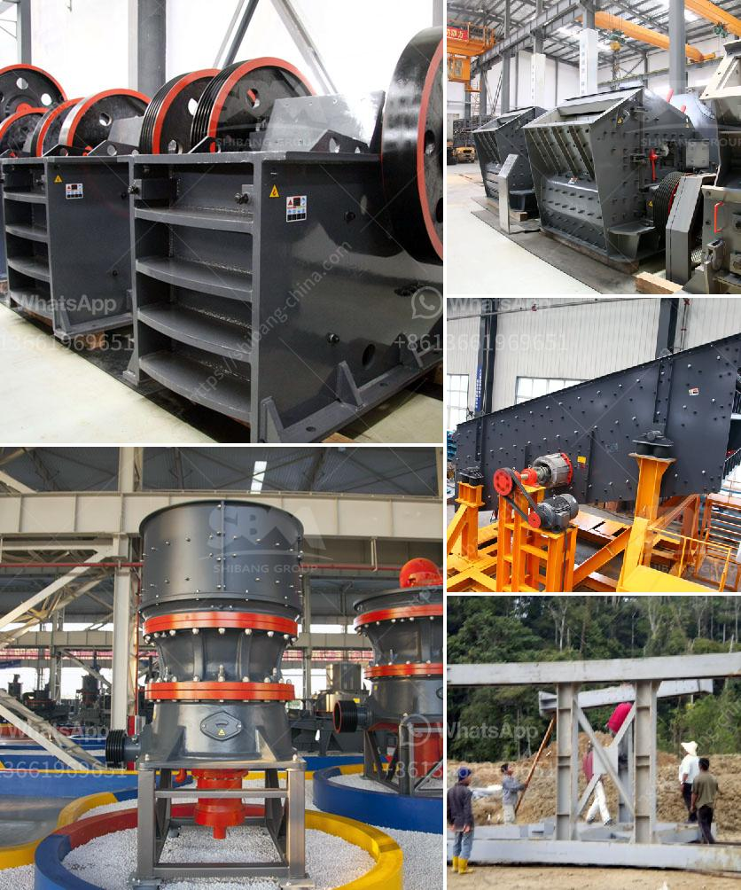

<h3>philippines cone crusher</h3>
The Philippines is a country blessed with abundant natural resources. It is rich in mineral resources such as copper, chromite, manganese, iron ore, and iron alloys. With these resources, we can develop various mining industries, such as iron ore mining industry, chromite ore mining industry, gold ore mining industry, and copper ore mining industry. These industries require the use of advanced equipment to extract and process these minerals efficiently. One of the essential equipment used in mining is the cone crusher.

A cone crusher is a machine that breaks rocks by squeezing them between an eccentrically gyrating cone (mantle) and a concave (bowl liner). The crushing action is provided by the closing of the gap between the mantle and the concave. Cone crushers are widely used in the mining industry because they allow large rocks to be processed efficiently.

In the Philippines, cone crushers are commonly used in crushing ores and rocks in the secondary and tertiary stages. They are usually used in conjunction with other types of crushers, such as jaw crushers and impact crushers, to further process the ores and achieve finer crushing. Cone crushers have many advantages, such as high productivity, low operating cost, easy maintenance, and adjustable discharge size.

Many Philippine mining companies rely on cone crushers for their ore crushing needs. Cone crushers are particularly popular among small and medium-scale miners due to their relatively low cost and ease of operation. Cone crushers are also widely used in various industries, such as cement production, construction materials, and road construction.

However, it is important to choose the right cone crusher for your specific needs. Factors such as the hardness of the material, the desired output size, and the capacity requirements should be considered when selecting a cone crusher. Additionally, regular maintenance and proper operation are crucial to ensure the longevity and efficiency of the cone crusher.

In conclusion, cone crushers are vital equipment in the mining industry. They play a crucial role in the efficient extraction and processing of minerals in the Philippines. With proper selection, operation, and maintenance, cone crushers can contribute to the growth and development of the Philippine mining industry.
<h3>Contact us</h3><ul><li><strong>Whatsapp:&nbsp;<a href="https://wa.me/8613661969651">+8613661969651</a></strong></li><li><a href="https://swt.shibang-china.com/?git&amp;zhl&amp;philippines cone crusher"><strong>Online Service(chat now)</strong></a></li></ul><h3>Related</h3><ul><li><a href='roller mill from china.md'>roller mill from china</a></li><li><a href='copper ore concentrate processing plant.md'>copper ore concentrate processing plant</a></li><li><a href='gold mining equipment in uae.md'>gold mining equipment in uae</a></li><li><a href='gold milling machine for sale in south africa.md'>gold milling machine for sale in south africa</a></li><li><a href='mica pearl process flowchart.md'>mica pearl process flowchart</a></li></ul>