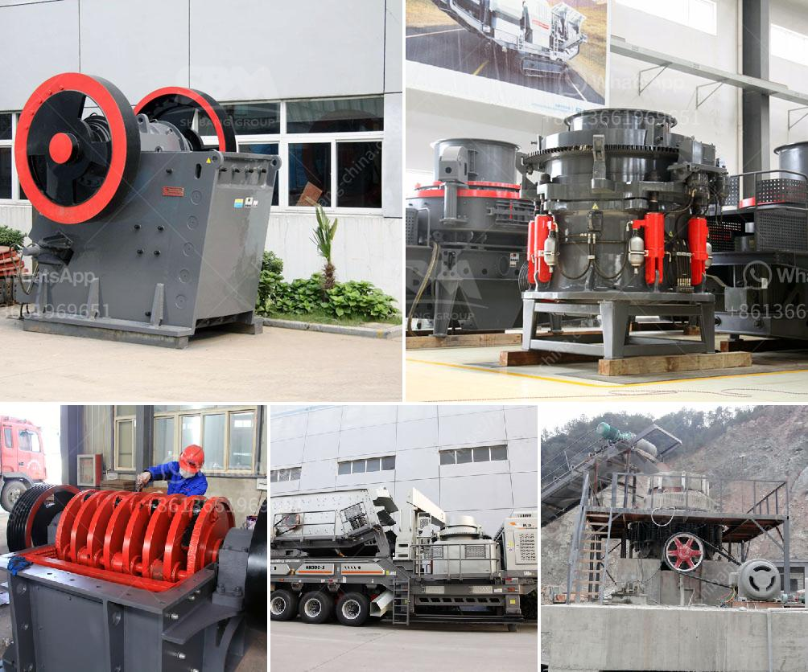

<h3>philippines crushing equipment for sale kenya</h3>
Title: Philippines Crushing Equipment for Sale in Kenya: Unlocking Potential in the Construction Industry

The construction industry in Kenya has witnessed tremendous growth in recent years, fueling the demand for high-quality materials and cutting-edge technology. The Philippines, renowned for its expertise in manufacturing crushing equipment, has emerged as a potential supplier for Kenya's construction industry. This article explores the advantages of purchasing crushing equipment from the Philippines and highlights the various options available in the market.

The Philippines' crushing equipment is known for its robust construction which ensures durability and longevity. The industry-leading technology and high-quality materials used in manufacturing machinery result in equipment capable of withstanding the rigorous demands of Kenya's construction projects.

Purchasing crushing equipment from the Philippines provides an opportunity to acquire state-of-the-art machinery at competitive prices. Due to the lower labor and production costs in the Philippines, buyers can enjoy cost savings without compromising on quality.

The Philippines offers a wide variety of crushing equipment options, allowing buyers to select machines that align with their specific requirements. From jaw crushers and impact crushers to cone crushers and vibrating screens, buyers have a vast array of equipment to choose from, enhancing productivity and efficiency in their construction projects.

Jaw crushers are widely used in the construction industry for their ability to crush the toughest materials. They are ideal for primary and secondary crushing, often used in aggregate production, mining operations, and recycling applications. Buyers can find jaw crushers from reputable manufacturers in the Philippines, ensuring reliability and performance.

Impact crushers are efficient machines used to crush different materials and create uniform particle sizes. These crushers are suitable for a wide range of applications, including quarrying, mining, and construction. The Philippines offers various impact crushers, each designed to handle specific materials and provide optimum results.

Cone crushers are sought-after machinery in the construction industry for their ability to produce finely crushed particles. They excel in secondary, tertiary, and quaternary crushing stages and are commonly used for aggregate production. The Philippines offers reliable cone crushers that cater to diverse customer requirements.

Vibrating screens play a crucial role in separating various sizes of crushed materials, ensuring efficient sorting and enhanced productivity. Buyers can find high-quality vibrating screens from the Philippines, which enhance the overall processing efficiency of crushing equipment.

With the exponential growth of Kenya's construction industry, investing in high-quality crushing equipment is essential to meet the increasing demand for sturdy construction materials. The Philippines' crushing equipment offers a lucrative opportunity for Kenyan buyers. It provides durable machinery, cost-effectiveness, and a wide range of options to choose from. Embracing the benefits of Philippines crushing equipment will unlock the potential for accelerated growth and success in Kenya's construction industry.
<h3>Contact us</h3><ul><li><strong>Whatsapp:&nbsp;<a href="https://wa.me/8613661969651">+8613661969651</a></strong></li><li><a href="https://swt.shibang-china.com/?git&amp;zhl&amp;philippines crushing equipment for sale kenya"><strong>Online Service(chat now)</strong></a></li></ul><h3>Related</h3><ul><li><a href='process of coal crushing plant.md'>process of coal crushing plant</a></li><li><a href='price of grinder machine in malaysia.md'>price of grinder machine in malaysia</a></li><li><a href='equipment design of coal washing plant.md'>equipment design of coal washing plant</a></li><li><a href='cement clinker grinding plant for sale in india.md'>cement clinker grinding plant for sale in india</a></li><li><a href='vertical mill calcium.md'>vertical mill calcium</a></li></ul>