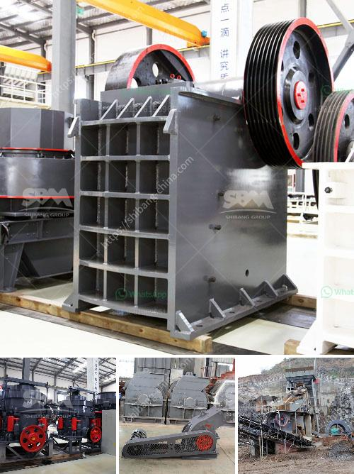

<h3>philippines stone crusher philippines</h3>
The Philippines is a country rich in mineral resources. With its close proximity to China, Japan, and other Southeast Asian countries, the Philippines has become a central hub for the mining industry. As a result, various stone crushing equipment have been developed in the Philippines.

Stone crushers are used in numerous mining and quarrying applications, primarily used in the construction of roads and buildings. The stone crusher industry in the Philippines is booming due to government infrastructure projects, which greatly contribute to the economic growth of the country.

In addition, the mining sector has been a key driver for the country's industrialization. As such, the Philippines stone crusher is an important piece of equipment that is used to crush large stones into smaller pieces in order to further process the materials for various construction and industrial uses.

The Philippines stone crusher is made up of jaw crusher, impact crusher, cone crusher, hammer crusher, VSI crusher and so on. Each of them is individually designed to handle different types of materials, efficiently crushing minuscule particles to the desired size and shape.

One of the main benefits of using a stone crusher is that it enhances efficiency in the mining process. Crushing stones allows mining companies to harvest minerals in the most efficient and effective way possible. Moreover, stone crushers reduce labor intensity and increase the overall productivity of the mining operations, making them economically viable and profitable.

The stone crushing industry also provides employment opportunities for the local population, thereby contributing to the reduction of poverty in the Philippines. Additionally, the stone crushers contribute to environmental conservation by reducing the pollution caused by dust emissions and noise pollution.

Given the growing demand for construction materials in the Philippines, the stone crusher industry is expected to continue thriving in the coming years. The government's aggressive infrastructure development plans, such as the Build, Build, Build program, will continue to drive the demand for stone crushers.

However, the stone crusher industry in the Philippines faces certain challenges. One of the main challenges is illegal mining, where individuals engage in mining activities without proper permits. This not only poses risks to the environment but also creates unfair competition for legitimate mining companies.

To address the challenges in the stone crusher industry, the Philippines government, in collaboration with industry stakeholders, has implemented various regulations and policies. These measures aim to promote responsible mining practices, ensure compliance with regulations, and foster sustainable development in the industry.

In conclusion, the stone crusher industry in the Philippines plays a crucial role in the country's mining and construction sectors. It provides employment opportunities, contributes to economic growth, and supports the government's infrastructure development plans. With proper regulation and responsible mining practices, the Philippines stone crusher industry is poised to thrive in the coming years.
<h3>Contact us</h3><ul><li><strong>Whatsapp:&nbsp;<a href="https://wa.me/8613661969651">+8613661969651</a></strong></li><li><a href="https://swt.shibang-china.com/?git&amp;zhl&amp;philippines stone crusher philippines"><strong>Online Service(chat now)</strong></a></li></ul><h3>Related</h3><ul><li><a href='jaw crusher for sale in china.md'>jaw crusher for sale in china</a></li><li><a href='mobile stone crusher price india.md'>mobile stone crusher price india</a></li><li><a href='feldspar beneficiation plant.md'>feldspar beneficiation plant</a></li><li><a href='iron ore pellet plant in odisha.md'>iron ore pellet plant in odisha</a></li><li><a href='copper slag recycling plants china.md'>copper slag recycling plants china</a></li></ul>