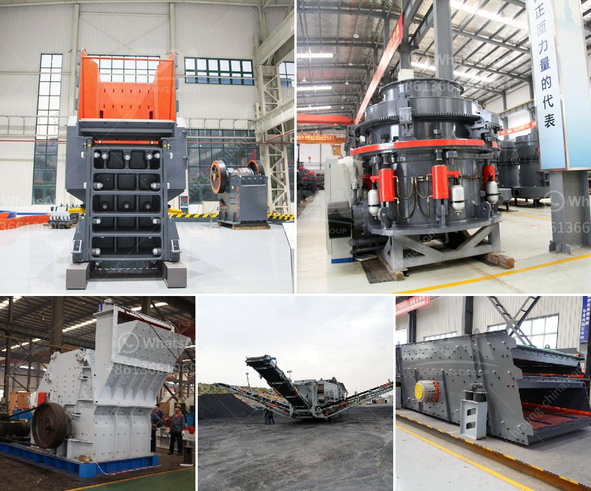

<h3>picture of concrete crusher machine</h3>
Concrete is one of the most used construction materials in the world. However, the process of producing this material leaves behind an enormous amount of waste, leaving environmentalists concerned. With the advent of advanced technology, a new concrete crusher machine is changing the conventional methods of disposal, combating the issue of environmental pollution and turning waste into valuable resources.

The attached picture showcases a modern concrete crusher machine, designed to extract maximum value from waste materials. The machine stands tall, with a high-powered engine and a robust crushing mechanism. Its powerful jaws can quickly and efficiently pulverize concrete into usable materials, capable of being reused in construction projects or recycled for other applications.

Concrete waste decomposes and releases harmful chemicals into the environment, leading to soil and water pollution. However, by employing the concrete crusher machine, waste concrete can be effectively processed to mitigate environmental damage. The machine crushes the concrete into smaller pieces, reducing its volume and facilitating easy transportation, thereby reducing pollution caused by transportation of waste.

One of the significant advantages of concrete crusher machines is their ability to extract and produce high-quality recycled aggregates. After crushing, the concrete waste is sorted into different sizes based on the requirements of the project. These recycled aggregates can then be used in new construction works, road bases, drainage systems, and even in the production of new concrete, reducing the need for traditional raw materials, which not only conserves natural resources but also reduces environmental impact.

By integrating a concrete crusher machine into construction projects, significant cost savings can be achieved. Instead of purchasing new construction materials, recycled aggregates can be used, reducing procurement costs. The transportation costs associated with disposal and procurement of new materials are also eliminated, making the process more economical.

Concrete crushers are highly versatile machines that can be used in various construction applications. Not only do they crush concrete efficiently, but they can also process other materials, such as bricks, asphalt, and rock. This flexibility allows for diverse usage in different projects, ensuring maximum value extraction from different waste types.

The picture illustrates a revolutionized approach to waste concrete management, with the powerful concrete crusher machine leading the way. By efficiently crushing and recycling waste, these machines are transforming a major environmental concern into a valuable resource. The ability to produce high-quality recycled aggregates while reducing environmental pollution is a win-win solution for the construction industry and the planet. Embracing this technology can lead to cost savings, reduced environmental impact, and sustainable construction practices.
<h3>Contact us</h3><ul><li><strong>Whatsapp:&nbsp;<a href="https://wa.me/8613661969651">+8613661969651</a></strong></li><li><a href="https://swt.shibang-china.com/?git&amp;zhl&amp;picture of concrete crusher machine"><strong>Online Service(chat now)</strong></a></li></ul><h3>Related</h3><ul><li><a href='quartz rock processing equipment.md'>quartz rock processing equipment</a></li><li><a href='calcite processing equipment.md'>calcite processing equipment</a></li><li><a href='chalcopyrite ore processing plant cost to built and sale.md'>chalcopyrite ore processing plant cost to built and sale</a></li><li><a href='jaw crusher adalah.md'>jaw crusher adalah</a></li><li><a href='new rubber belt conveyor for sale.md'>new rubber belt conveyor for sale</a></li></ul>