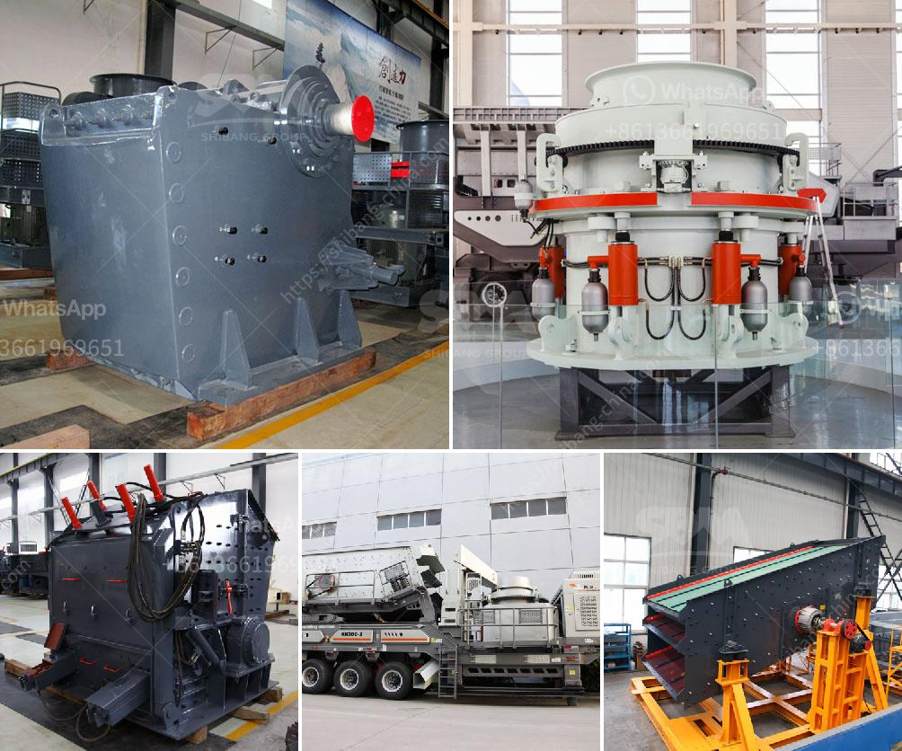

<h3>pilot scale ball mills</h3>
Pilot scale ball mills are an important tool in the process of developing and optimizing a multitude of materials and manufacturing processes. Whether it be for research purposes or as a prelude to full-scale production, pilot scale ball mills are an integral part of laboratory and pilot plant scale development.

Pilot scale ball mills are designed with different material options, allowing for the separation of abrasive and non-abrasive materials. These mills are designed for handling different particle sizes and are integrated with features such as wear plates and liners, ensuring minimal maintenance and extended service life.

One of the main advantages of pilot scale ball mills is their ability to produce a uniform and narrow particle size distribution, allowing for more accurate control of the final product. This is especially important in industries such as pharmaceuticals, where the size and distribution of particles can greatly affect the efficacy of the drug.

The versatility of pilot scale ball mills allows for the testing and optimization of various operating parameters, including mill speed, mill filling, ball size, and distribution. Through systematic experimentation, researchers and engineers can evaluate the impact of these parameters on the desired material properties, such as particle size, shape, and crystallinity.

Pilot scale ball mills also play a crucial role in the development of new materials and manufacturing processes. The ability to scale up from a laboratory scale to a pilot scale provides researchers and engineers with valuable insights into the behavior of materials under different conditions and the feasibility of large-scale production.

In addition to their scientific and engineering applications, pilot scale ball mills are also utilized in educational and training programs. By providing students and trainees with hands-on experience with pilot scale equipment, they can learn how to operate and troubleshoot these machines, enhancing their practical skills and knowledge in the field.

Overall, pilot scale ball mills are indispensable tools in the testing, development, and optimization of materials and manufacturing processes. They offer a cost-effective and efficient solution for researchers, engineers, and manufacturers to explore the behavior of materials under different conditions, evaluate process parameters, and scale up from laboratory to pilot plant scale. This makes them an essential component in the advancement of various industries, including pharmaceuticals, materials science, chemical engineering, and many more.
<h3>Contact us</h3><ul><li><strong>Whatsapp:&nbsp;<a href="https://wa.me/8613661969651">+8613661969651</a></strong></li><li><a href="https://swt.shibang-china.com/?git&amp;zhl&amp;pilot scale ball mills"><strong>Online Service(chat now)</strong></a></li></ul><h3>Related</h3><ul><li><a href='barite crusher machine.md'>barite crusher machine</a></li><li><a href='used cone crusher for sale ton per hour.md'>used cone crusher for sale ton per hour</a></li><li><a href='roller mill for powders.md'>roller mill for powders</a></li><li><a href='turkey plant production line of gypsum powder.md'>turkey plant production line of gypsum powder</a></li><li><a href='different between the mill and hammer crusher.md'>different between the mill and hammer crusher</a></li></ul>