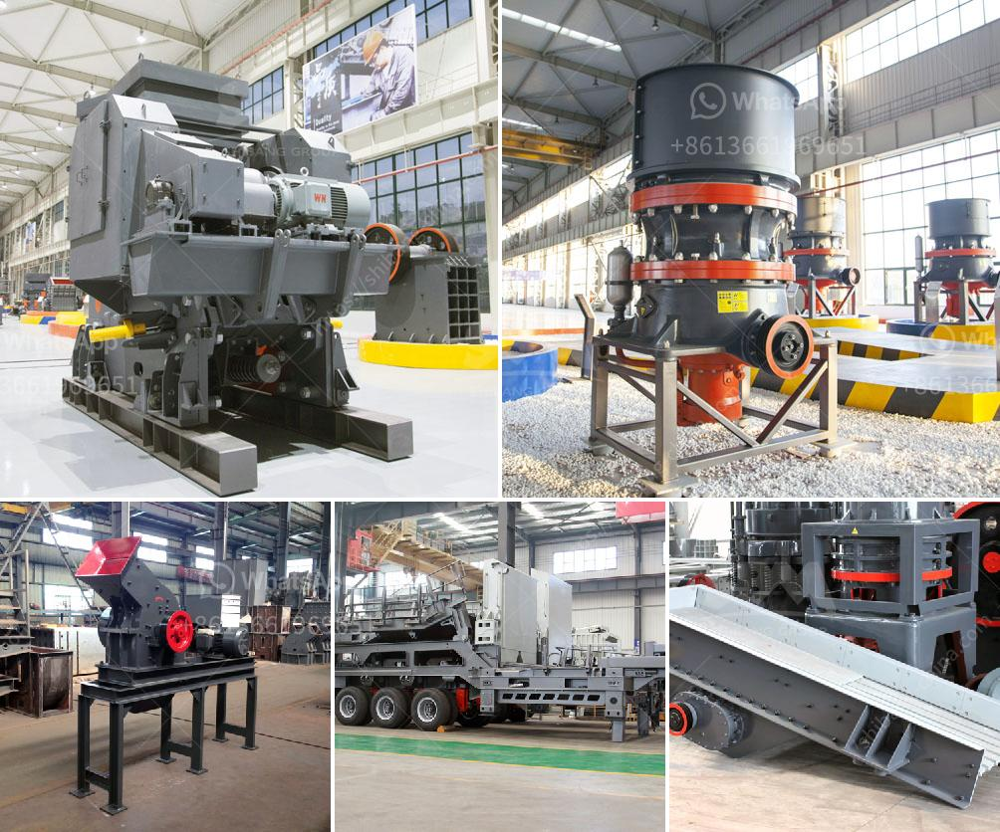

<h3>pioneer 3042 jaw crusher part</h3>
The Pioneer 3042 jaw crusher is a robust and powerful machine that delivers top performance. Designed specifically for rugged applications, this machine offers superior strength, reliability, and durability. It features a rugged and heavy-duty design that can handle even the toughest materials. Whether you are crushing hard rock, gravel, or concrete, the Pioneer 3042 jaw crusher can handle it all.

One of the key features of the Pioneer 3042 jaw crusher is its ability to adjust the closed side setting (CSS) quickly and easily. This ensures that the product size is consistently maintained, even when operating under heavy load conditions. The CSS adjustment system is both efficient and user-friendly, allowing operators to quickly change the setting to produce the desired product size.

In addition to its powerful performance, the Pioneer 3042 jaw crusher offers excellent accessibility for maintenance and repairs. The machine features a unique, easy-to-access maintenance platform that allows operators to easily reach all key components for inspection and servicing. This reduces downtime and increases operational efficiency.

The Pioneer 3042 jaw crusher is also equipped with a variety of advanced safety features to ensure the safety of both operators and maintenance personnel. These features include a hydraulic relief system that prevents damage to the crusher in the event of an uncrushable material entering the crushing chamber. Additionally, the machine is equipped with a hydraulic toggle system that provides overload protection and reduces the risk of toggle plate breakage.

Furthermore, the Pioneer 3042 jaw crusher comes with a range of optional extras to enhance productivity and efficiency. These include a hydraulic crusher adjustment system, which allows for quick and easy adjustments to the crusher settings. This ensures maximum productivity and efficiency in various applications.

Another key feature of the Pioneer 3042 jaw crusher is its ease of transport and mobility. The machine is designed to be easily transported from one site to another, making it ideal for contractors who need to move their equipment frequently. This also allows for quick setup and teardown, reducing downtime and increasing productivity.

Overall, the Pioneer 3042 jaw crusher is a reliable and powerful machine that offers exceptional performance in various applications. Its robust design, advanced safety features, and ease of maintenance make it an ideal choice for crushing a wide range of materials. Whether you are in the mining, quarrying, construction, or recycling industry, the Pioneer 3042 jaw crusher is a top choice for productivity and efficiency.
<h3>Contact us</h3><ul><li><strong>Whatsapp:&nbsp;<a href="https://wa.me/8613661969651">+8613661969651</a></strong></li><li><a href="https://swt.shibang-china.com/?git&amp;zhl&amp;pioneer 3042 jaw crusher part"><strong>Online Service(chat now)</strong></a></li></ul><h3>Related</h3><ul><li><a href='ball mill lining made in china.md'>ball mill lining made in china</a></li><li><a href='sand and gravel plant in nepal.md'>sand and gravel plant in nepal</a></li><li><a href='equipment costs for cement plant.md'>equipment costs for cement plant</a></li><li><a href='hammer mill dimension.md'>hammer mill dimension</a></li><li><a href='vibrating sieving machine.md'>vibrating sieving machine</a></li></ul>