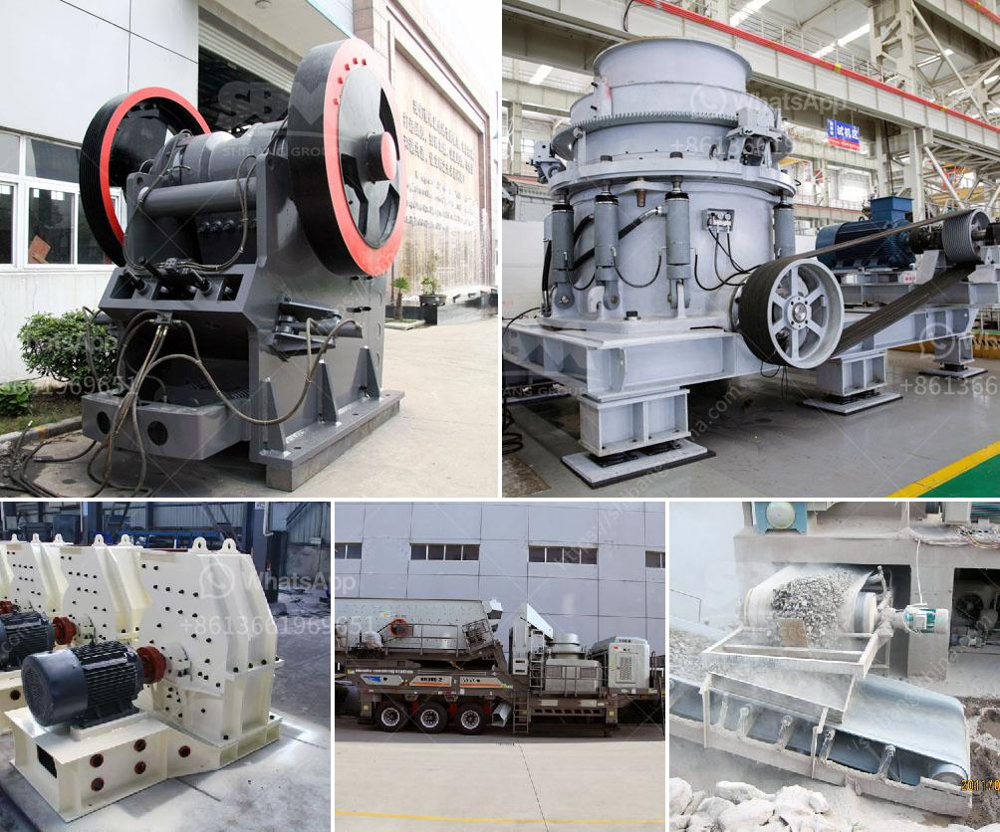

<h3>plant plant silica washing washing plant</h3>
Plant silica is an essential element for the healthy growth and development of plants. It is a natural compound that plays a crucial role in strengthening plant cells and providing structural support. Silica also helps plants to withstand various environmental stresses such as heat, drought, and pest attacks. In order to ensure the optimal supply of silica to plants, it is important to wash them with a silica washing plant.

A silica washing plant is a horticultural tool that allows for the efficient cleaning of plant surfaces, specifically leaves and stems. These surfaces can accumulate dust, dirt, and other debris that hinder the absorption of sunlight and nutrients by the plants. By removing these contaminants, the silica washing plant ensures that plants can absorb and utilize silica effectively.

The washing process involves spraying a fine mist of water mixed with a silica solution onto the plant surfaces. The silica solution is typically prepared by dissolving a silica-based fertilizer in water. As the mist settles on the leaves and stems, it loosens and dislodges any accumulated dust, dirt, or pests. The plant is then rinsed with clean water to remove any residues.

Regular washing with a silica washing plant offers numerous benefits to plants. Firstly, it helps to maintain the health and integrity of plant tissues by removing any potential sources of infections or diseases. Secondly, it allows for the optimal absorption of sunlight, which is crucial for photosynthesis and the production of energy. Furthermore, a clean plant surface facilitates the efficient uptake of water and nutrients from the soil.

In conclusion, a silica washing plant is a valuable tool for plant care and maintenance. By keeping plant surfaces clean and free from contaminants, it ensures the optimal supply and utilization of silica. This, in turn, supports healthy growth and development, as well as the ability of plants to withstand various stress factors. Ultimately, investing in a silica washing plant is a wise choice for any horticultural enthusiast or professional.
<h3>Contact us</h3><ul><li><strong>Whatsapp:&nbsp;<a href="https://wa.me/8613661969651">+8613661969651</a></strong></li><li><a href="https://swt.shibang-china.com/?git&amp;zhl&amp;plant plant silica washing washing plant"><strong>Online Service(chat now)</strong></a></li></ul><h3>Related</h3><ul><li><a href='processing of kaolin crusher.md'>processing of kaolin crusher</a></li><li><a href='concrete crusher plant uae.md'>concrete crusher plant uae</a></li><li><a href='jaw crusher for sale uk.md'>jaw crusher for sale uk</a></li><li><a href='grinding media balls suppliers in south africa.md'>grinding media balls suppliers in south africa</a></li><li><a href='conveyor belts for mining.md'>conveyor belts for mining</a></li></ul>