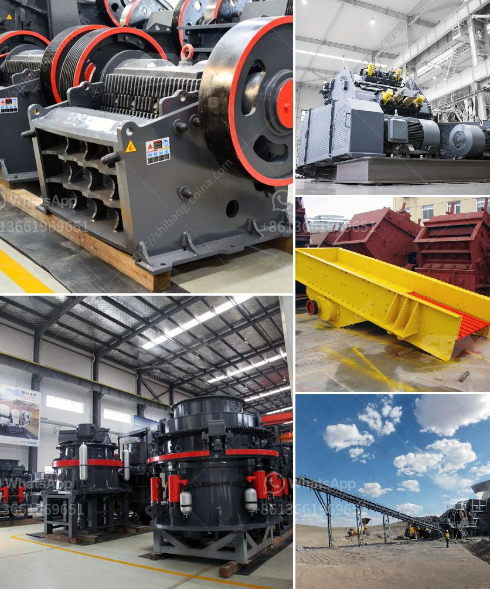

<h3>portable concrete crusher rental maryland</h3>
If you're working on a construction or demolition project, chances are you'll need to crush concrete. Whether you're demolishing a building or removing concrete slabs, a portable concrete crusher rental from a trusted supplier is a must. Covering Maryland and surrounding areas, the portable concrete crusher rental Maryland residents and contractors know and trust will get the job done quickly, efficiently, and safely.

One of the main advantages of choosing a portable concrete crusher rental Maryland is its convenience. You can move the crusher to the job site, saving transportation costs and reducing the need for additional equipment. This flexibility also allows for easy access to tight spaces, such as residential areas, where larger machinery might not fit. The portable nature of these crushers also enables swift setup and dismantling, ensuring maximum productivity for your project.

Another crucial aspect to consider when considering portable concrete crusher rental Maryland is the versatility. These crushers can handle a wide range of materials, including concrete, bricks, asphalt, and other construction and demolition waste. By providing a cost-effective solution for onsite concrete crushing, portable crushers can significantly reduce your expenses and environmental impact. Rather than disposing of concrete waste at landfills, you can recycle it on-site, making it an eco-friendly choice.

Additionally, rental services often include comprehensive support, ensuring a smooth operation throughout your project. Regular maintenance and repairs are essential to keep the crusher in peak performance, and reliable suppliers will take care of these tasks while you focus on your project. Renting also allows for access to the latest crusher models, offering advanced features and improved efficiency.

When searching for portable concrete crusher rental Maryland, it's crucial to work with a reputable and experienced supplier. Look for a company with a proven track record in the industry, and don't hesitate to ask for recommendations or read customer reviews. By choosing a trusted rental provider, you can have peace of mind knowing that you'll receive quality equipment, expertise, and support.

In conclusion, portable concrete crusher rental Maryland offers a convenient and cost-effective solution for your concrete crushing needs. Not only does it save transportation costs and provide easy access to tight spaces, but it also allows for on-site recycling and reduces environmental impact. With comprehensive support from reputable suppliers, renting a portable concrete crusher becomes an efficient and hassle-free option for any construction or demolition project in Maryland.
<h3>Contact us</h3><ul><li><strong>Whatsapp:&nbsp;<a href="https://wa.me/8613661969651">+8613661969651</a></strong></li><li><a href="https://swt.shibang-china.com/?git&amp;zhl&amp;portable concrete crusher rental maryland"><strong>Online Service(chat now)</strong></a></li></ul><h3>Related</h3><ul><li><a href='marble crusher cost.md'>marble crusher cost</a></li><li><a href='china portable jaw crusher plant manufacturers china.md'>china portable jaw crusher plant manufacturers china</a></li><li><a href='mobile crusher plant for sale.md'>mobile crusher plant for sale</a></li><li><a href='small scale copper refinery project ideas.md'>small scale copper refinery project ideas</a></li><li><a href='crusher how to calculate the cost of returns.md'>crusher how to calculate the cost of returns</a></li></ul>