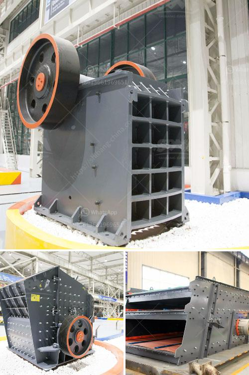

<h3>portable crusher manufacturer</h3>
In the construction industry, efficiency is key. Projects often have tight deadlines, and every minute counts. This is where portable crushing equipment plays a crucial role. A portable crusher allows contractors to dispose of materials on-site, saving time, money, and reducing the need for transportation. As the demand for portable crushers grows, many companies have started to emerge in the market. One such notable player is [Insert Portable Crusher Manufacturer], a renowned name in the industry.

[Insert Portable Crusher Manufacturer] has been in the business for decades, specializing in the design, manufacture, and supply of portable crushing equipment. They understand the unique needs of construction sites and have developed a range of crushers that provide exceptional performance in demanding conditions. From demolition waste to natural stone, their crushers can handle a wide range of materials effectively.

One of the key advantages of [Insert Portable Crusher Manufacturer] is their focus on innovation. They constantly strive to improve their equipment, incorporating the latest technologies to enhance performance and reliability. This commitment to innovation has resulted in portable crushers that are highly efficient, easy to operate, and require minimal maintenance. With features such as remote control operation and advanced hydraulic systems, these crushers make the crushing process more convenient and efficient.

Durability is another crucial aspect of portable crushers, considering the demanding nature of construction sites. [Insert Portable Crusher Manufacturer] understands the need for robust equipment that can withstand harsh conditions. Their crushers are built to last, using high-quality materials and advanced engineering techniques. This ensures that contractors can rely on their equipment for long-term use without worrying about breakdowns or costly repairs.

Another significant advantage of [Insert Portable Crusher Manufacturer] is their commitment to customer service. They believe in building strong relationships with their clients and providing exceptional support throughout the entire process, from pre-sales consultations to after-sales service. Their team of experts is always available to provide guidance, offer solutions, and address any concerns. This level of customer service ensures that contractors have a seamless experience and can rely on [Insert Portable Crusher Manufacturer] for their crushing needs.

Environmental sustainability is a growing concern in the construction industry. [Insert Portable Crusher Manufacturer] recognizes this and aims to minimize their impact on the environment. Their crushers are designed to be fuel-efficient, reducing emissions and operating costs. Additionally, they offer solutions for recycling and reusing construction waste, contributing to a more sustainable construction process.

In conclusion, [Insert Portable Crusher Manufacturer] is a reputable player in the portable crushing equipment market. Their commitment to innovation, durability, customer service, and environmental sustainability sets them apart from the competition. With their range of efficient and reliable crushers, they bring convenience to construction sites, helping contractors save time, money, and resources. As the demand for portable crushers continues to grow, [Insert Portable Crusher Manufacturer] remains at the forefront, providing reliable solutions and driving the industry forward.
<h3>Contact us</h3><ul><li><strong>Whatsapp:&nbsp;<a href="https://wa.me/8613661969651">+8613661969651</a></strong></li><li><a href="https://swt.shibang-china.com/?git&amp;zhl&amp;portable crusher manufacturer"><strong>Online Service(chat now)</strong></a></li></ul><h3>Related</h3><ul><li><a href='gravel sand wash plants canada for sale.md'>gravel sand wash plants canada for sale</a></li><li><a href='crusher near sale saudi arabia.md'>crusher near sale saudi arabia</a></li><li><a href='concrete grinding machine manufacturers.md'>concrete grinding machine manufacturers</a></li><li><a href='mobile crushing plant for limestone.md'>mobile crushing plant for limestone</a></li><li><a href='raymond mill monterrey.md'>raymond mill monterrey</a></li></ul>