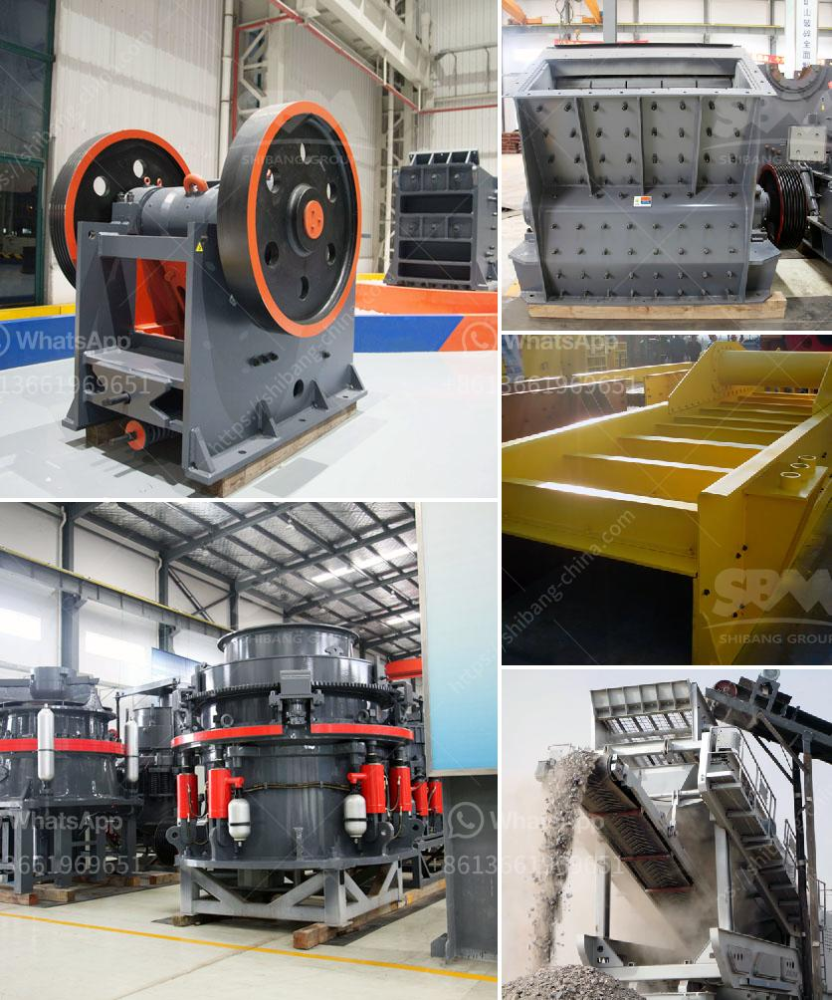

<h3>portable crushers</h3>
Portable crushers are an essential tool in the construction, mining, and recycling industries. These machines have become a necessity due to their ability to easily move around a job site, eliminating the need for expensive transportation and reducing overall project costs. In this article, we will explore the benefits and applications of portable crushers.

One of the main advantages of portable crushers is their mobility. These machines can be easily transported from one job site to another, allowing construction companies to save time and money on transportation costs. Traditional crushers, on the other hand, require specialized vehicles for transportation, making them less efficient in terms of productivity and cost.

Moreover, portable crushers are flexible and can be quickly set up and dismantled on site. This allows for rapid deployment and dismantling, making them ideal for temporary job sites or projects with varying locations. Whether it's a construction project, quarry operation, or demolition site, portable crushers provide a flexible solution to meet the demands of the task at hand.

In addition to their mobility, portable crushers offer a wide range of applications. They can be used for various materials, including concrete, asphalt, and natural stone. This versatility makes them suitable for a wide range of projects, such as road construction, building demolition, and recycling of construction waste. Portable crushers can crush and process these materials on site, reducing the need for transportation and disposal of waste materials.

Furthermore, portable crushers are designed to be highly efficient and productive. With advanced technology, these machines can crush large quantities of materials in a short amount of time. The ability to process materials on site eliminates the need for additional machinery and reduces the overall project timeline.

Another benefit of portable crushers is their environmental impact. By crushing materials on site, these machines reduce the need for transportation, thereby reducing carbon emissions and fuel consumption. Additionally, portable crushers can process and recycle construction waste, helping to minimize the amount of waste that ends up in landfills.

When choosing a portable crusher, it is important to consider factors such as the capacity, size, and power requirements of the machine. These specifications will depend on the specific needs of the project and the type of materials that need to be processed.

In conclusion, portable crushers play a crucial role in the construction, mining, and recycling industries. With their mobility, versatility, and efficiency, these machines offer a flexible and cost-effective solution for various applications. By eliminating the need for transportation and processing materials on site, portable crushers help reduce project costs, improve productivity, and minimize environmental impact.
<h3>Contact us</h3><ul><li><strong>Whatsapp:&nbsp;<a href="https://wa.me/8613661969651">+8613661969651</a></strong></li><li><a href="https://swt.shibang-china.com/?git&amp;zhl&amp;portable crushers"><strong>Online Service(chat now)</strong></a></li></ul><h3>Related</h3><ul><li><a href='stone crushing production process.md'>stone crushing production process</a></li><li><a href='used rock crusher dealers in usa.md'>used rock crusher dealers in usa</a></li><li><a href='to choose jaw crusher.md'>to choose jaw crusher</a></li><li><a href='sandstone crusher quarry.md'>sandstone crusher quarry</a></li><li><a href='mill gypsum for sale in india.md'>mill gypsum for sale in india</a></li></ul>