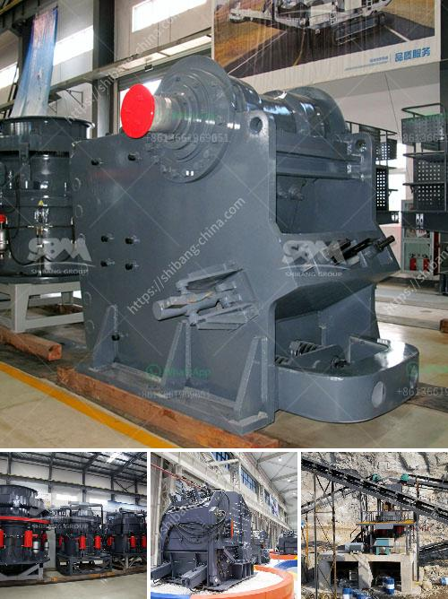

<h3>portable gold mining hammer mills</h3>
The gold mining industry has a long history of contributing to economic growth and development across the globe. However, mining activities can have negative environmental and social impacts if not properly managed. In recent years, there has been an increased focus on responsible and sustainable mining practices, which includes the adoption of innovative technologies. One such technology that has gained traction in the small-scale mining sector is the portable gold mining hammer mill.

Small-scale mining, also known as artisanal mining, is often carried out by individuals or small groups of people using basic equipment and techniques. These miners primarily extract and process minerals such as gold, silver, and copper, often in remote and hard-to-reach areas. Due to limited resources and access to sophisticated machinery, they rely on simple tools to extract and process ore, including hammer mills.

A traditional hammer mill is a device that uses high-speed rotating hammers to crush and shred ore into smaller pieces. These smaller pieces are then processed further to extract valuable minerals. Portable hammer mills are designed to be easily transported and set up at various mining sites.

One of the key advantages of portable hammer mills is their versatility. They can be used in a variety of mining scenarios, from dry crushing and grinding of ore to wet grinding in sluice boxes. This flexibility allows small-scale miners to adapt to different geological conditions and ore types, maximizing their chances of finding and extracting gold.

The compact size and portability of these hammer mills make them suitable for small-scale miners who often work in remote and hard-to-access locations. They can easily be transported to different mining sites, reducing the need for costly infrastructure development. These mills are typically powered by diesel engines, further enhancing their mobility and independence from the grid.

In addition to their portability, portable gold mining hammer mills are also known for their efficiency. Their high-speed rotating hammers pulverize ore quickly, ensuring faster processing and increased gold recovery rates. This efficiency translates to more gold being extracted per ton of ore processed, which is crucial for the economic viability of small-scale mining operations.

Furthermore, portable hammer mills offer an environmentally friendly alternative to mercury-based gold extraction methods, which are commonly used in small-scale mining. Mercury is a highly toxic substance that poses severe risks to human health and the environment. By adopting hammer mills, small-scale miners can reduce their reliance on mercury and contribute to more sustainable and responsible mining practices.

While portable gold mining hammer mills have numerous benefits, it is essential to address the associated challenges. For instance, the need for proper training and education on the safe and responsible use of these mills is crucial. Additionally, the availability of spare parts and maintenance support can be an issue in remote mining areas, requiring strategic planning and support from mining organizations, governments, and international stakeholders.

In conclusion, portable gold mining hammer mills have the potential to revolutionize small-scale mining operations by providing a versatile, efficient, and environmentally friendly tool for ore processing. However, their successful adoption requires collaboration among stakeholders to address challenges and ensure the sustainable growth and development of the small-scale mining sector.
<h3>Contact us</h3><ul><li><strong>Whatsapp:&nbsp;<a href="https://wa.me/8613661969651">+8613661969651</a></strong></li><li><a href="https://swt.shibang-china.com/?git&amp;zhl&amp;portable gold mining hammer mills"><strong>Online Service(chat now)</strong></a></li></ul><h3>Related</h3><ul><li><a href='floatation method of analysis for silica sand.md'>floatation method of analysis for silica sand</a></li><li><a href='cost of mobile crusher in india.md'>cost of mobile crusher in india</a></li><li><a href='manufacturer of quartz powder mill.md'>manufacturer of quartz powder mill</a></li><li><a href='sand and gravel plant in nepal.md'>sand and gravel plant in nepal</a></li><li><a href='diamond stone crusher.md'>diamond stone crusher</a></li></ul>