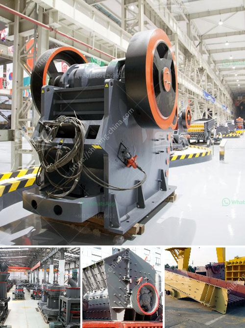

<h3>portable jaw crusher in saudi</h3>
Portable jaw crusher is equipped with jaw crusher which is the most popular stone crusher with unbelieveable high performance. Jaw crusher can process ores with compressive strength not more than 320MPa to medium-grain, and its yield can be 2,200t/h.

Saudi Arabia is rich in mineral resources, especially solid mineral resources. The reserves of mineral resources are estimated to be billions of tons. With such a large number of resources, the mining industry will inevitably generate a lot of waste. Jaw crusher manufacturers have launched portable jaw crusher to save energy and promote resource utilization.

Portable jaw crusher is a new rock crushing equipment, which is the basis of SBM many years of crushing equipment manufacturing experience, using the most advanced manufacturing processes and crushing technology developed a new type of crushing equipment. It has the characteristics of energy saving, high output, simple structure, reliable operation and convenient maintenance. Portable jaw crusher has become the ideal equipment for construction waste recycling.

Due to its unique advantages, portable jaw crusher is preferred among various kinds of crushers many clients can choose according to the actual production requirements. Portable jaw crusher is mainly used for construction waste processing, recycling, and grinding. Crushing construction waste requires jaw crusher mainly the feed is large, and the size of the discharge is not adjustable. In terms of equipment, the portable jaw crusher has a large market in India.

The three-stage portable jaw crusher is a kind of gravel, sand and hard rock after the final work of the crusher, the equipment has a good processing effect and has a high crushing efficiency for construction waste. This combination is also more popular in the market because the price and cost of our product are relatively low and the price is affordable.

The portable jaw crusher has a strong adaptability to materials. Therefore, it is very suitable for outdoor materials such as mountainous areas and construction waste sites. It is also suitable for various types of mines and can provide customized crushing equipment according to different needs of customers.

Portable jaw crusher is designed to meet the needs of customers for a variety of applications, with low investment costs, convenient transportation, and high crushing efficiency, as well as a wide range of applications. It is widely used in metallurgy, chemical industry, building materials, electric power, transportation and other industries. With its excellent performance and reliable quality, it has won the trust of customers and has become a popular choice in the field of crushing equipment.
<h3>Contact us</h3><ul><li><strong>Whatsapp:&nbsp;<a href="https://wa.me/8613661969651">+8613661969651</a></strong></li><li><a href="https://swt.shibang-china.com/?git&amp;zhl&amp;portable jaw crusher in saudi"><strong>Online Service(chat now)</strong></a></li></ul><h3>Related</h3><ul><li><a href='project report of a tph stone crusher.md'>project report of a tph stone crusher</a></li><li><a href='marble quarry crusher equipments.md'>marble quarry crusher equipments</a></li><li><a href='diesel engine stone crusher small for quarry project.md'>diesel engine stone crusher small for quarry project</a></li><li><a href='copper ore concentrate processing plant.md'>copper ore concentrate processing plant</a></li><li><a href='stone crusher zenith.md'>stone crusher zenith</a></li></ul>