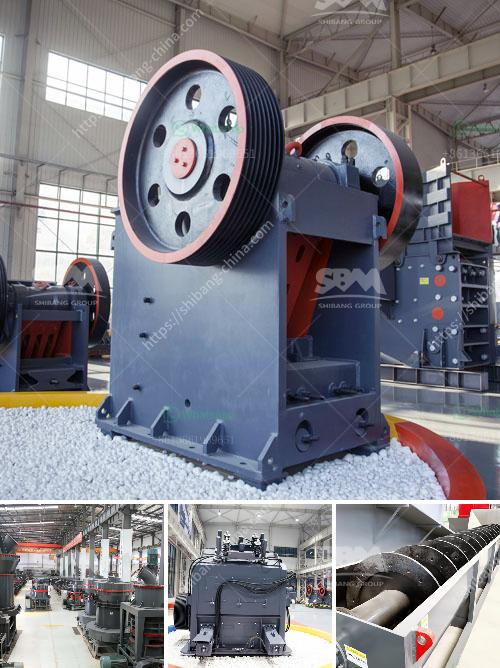

<h3>portable jaw crusher plant</h3>
Portable jaw crusher plant is a new type of stone crushing equipment, designed and researched by XSM Machinery team in combination with the latest international technology and decades of experience in the production of mining equipment. It is especially suitable for processing construction waste and producing aggregate materials for road construction and railway construction.

The portable jaw crusher plant is integrated with a jaw crusher, vibrating feeder, vibrating screen and belt conveyor. It is able to complete the crushing and screening operations all at once in unit time. This equipment is applicable for the processing of various materials such as granite, limestone, basalt, pebble, gravel and construction waste, etc. It can be used for primary crushing, secondary crushing and fine crushing, and it is widely used in mining, quarrying, construction, highway, railway and other industries.

The portable jaw crusher plant has the advantages of reasonable match, unobstructed material discharge, reliable run, convenient operation, high efficiency and energy saving, good quaility of the finished product and large handling capacity, among others. It is well received by customers both at home and abroad.

The crushing and screening process of portable jaw crusher plant is completed by the vibrating feeder, jaw crusher, and vibrating screen. Firstly, the materials are fed into the vibrating feeder by the excavator or wheel loader. Then, the feeder can prescreen the materials before they enter into the jaw crusher, which prevents the clogging of the crushing chamber.

The processed materials are then transported by the belt conveyor into the jaw crusher for primary crushing. In the jaw crusher, the oversized materials will be further crushed by the impact crusher or cone crusher, and the finished product is screened by the vibrating screen. The final product can be used in road construction, railway construction or other areas depending on customer requirements.

Portable jaw crusher plant is a useful construction waste processing equipment. It not only solves the problem of the cumbersome construction waste transportation, but also improves the utilization rate of various resources. The portable jaw crusher plays a key role in the mining industry and has a bright future. In addition, it is flexible and easy to operate, eliminating the installation of complex infrastructure and ancillary facilities. It truly provides customers with efficient and low-cost operation. With the continuous development of mining exploitation, portable jaw crusher plant will have a bright future.
<h3>Contact us</h3><ul><li><strong>Whatsapp:&nbsp;<a href="https://wa.me/8613661969651">+8613661969651</a></strong></li><li><a href="https://swt.shibang-china.com/?git&amp;zhl&amp;portable jaw crusher plant"><strong>Online Service(chat now)</strong></a></li></ul><h3>Related</h3><ul><li><a href='how much does a quarry machine cost.md'>how much does a quarry machine cost</a></li><li><a href='mobile crusher 100tph.md'>mobile crusher 100tph</a></li><li><a href='conveyor belt seller in philippines.md'>conveyor belt seller in philippines</a></li><li><a href='rock crushing limpopo.md'>rock crushing limpopo</a></li><li><a href='diamond mining equipment.md'>diamond mining equipment</a></li></ul>