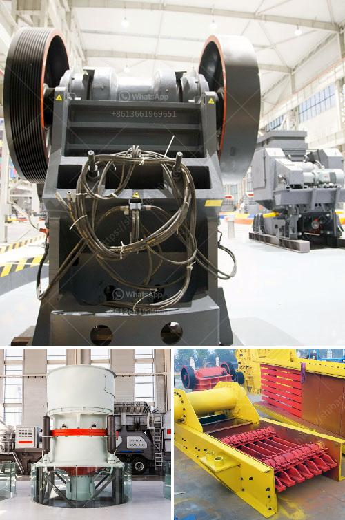

<h3>portable mobile stone crushing plants</h3>
Portable mobile stone crushing plants are extensively used in quarry, mining and construction operations in order to improve their efficiency and reduce their overall cost. Here are some key benefits of mobile stone crushing plants:

1. Convenient and efficient: The biggest advantage of these machines is their portability. They enable operators to be more flexible in terms of location and can be easily transported to different sites without the need for additional equipment or infrastructure. This allows for quick setup and dismantling, saving time and reducing labor costs.

2. Increased productivity: Mobile stone crushing plants enable operators to produce a wide range of high-quality materials, including aggregates, gravel, and sand. These plants can be equipped with various crushing tools and screening units to meet different raw material specifications and production requirements. As a result, operators can maximize their productivity by producing a variety of products in different sizes, which can be sold or used directly in construction projects.

3. Cost-effective: Mobile stone crushing plants can significantly reduce transportation costs, especially for long-distance projects. Since these plants can be easily moved, operators can avoid costly transportation expenses by simply relocating the crushing unit closer to the project site. This eliminates the need for additional trucks or conveyors and reduces fuel consumption. Additionally, mobile stone crushing plants can also be powered by generators, making them more cost-effective in remote areas where access to electricity is limited.

4. Environmental friendly: With the increasing focus on sustainable development, mobile stone crushing plants provide a more environmentally friendly solution compared to traditional stationary plants. These plants are designed to be fuel-efficient, emitting lower levels of harmful emissions. Furthermore, they can be equipped with dust suppression systems, which reduce dust and noise pollution. This makes them suitable for urban areas where strict environmental regulations are in place.

5. Versatility: Mobile stone crushing plants are highly versatile and can be used for various applications. In addition to quarry mining and construction, they can also be used for recycling and demolition activities. By crushing and screening waste materials, these plants can help reduce landfill waste and provide valuable resources for reuse. Moreover, the portable nature of these plants allows operators to quickly respond to changing demands and take advantage of new business opportunities.

In conclusion, portable mobile stone crushing plants offer numerous benefits to quarry, mining, and construction operations. They provide convenience and flexibility, increase productivity, reduce costs, and are environmentally friendly. With their versatility and ability to adapt to different applications, these plants are becoming an essential tool for industries looking to maximize their efficiency and profitability.
<h3>Contact us</h3><ul><li><strong>Whatsapp:&nbsp;<a href="https://wa.me/8613661969651">+8613661969651</a></strong></li><li><a href="https://swt.shibang-china.com/?git&amp;zhl&amp;portable mobile stone crushing plants"><strong>Online Service(chat now)</strong></a></li></ul><h3>Related</h3><ul><li><a href='industrial crusher for sale.md'>industrial crusher for sale</a></li><li><a href='stone crusher plant in westbengal.md'>stone crusher plant in westbengal</a></li><li><a href='manufacturing process of portland slag cement.md'>manufacturing process of portland slag cement</a></li><li><a href='objectives of ball mill.md'>objectives of ball mill</a></li><li><a href='coal washing machines.md'>coal washing machines</a></li></ul>