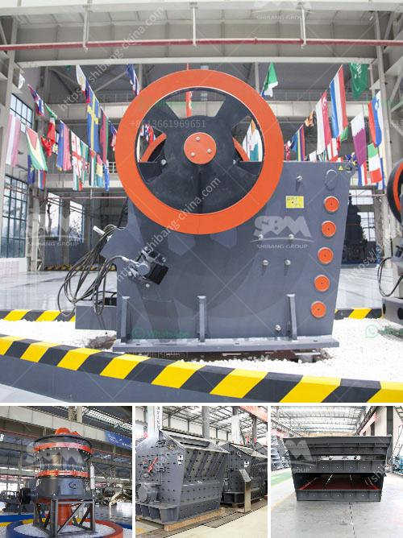

<h3>portable portable hammer mill</h3>
A portable hammer mill is a machine designed to shred or crush materials into smaller pieces. It is highly versatile and can be used for various materials, such as wood chips, paper, biomass, and even stones. The hammer mill operates by rotating hammers attached to a shaft, which spins at high speed inside a cylindrical chamber.

One of the key benefits of a portable hammer mill is its mobility. Unlike traditional hammer mills that are fixed in one location, a portable hammer mill can be easily transported to different work sites. This makes it convenient for users who need to process materials at multiple locations, such as farmers, contractors, and recycling facilities.

The size and power of a portable hammer mill can vary depending on the application and the desired output. Some portable hammer mills can process up to 300 pounds of materials per hour, which is ideal for small-scale operations. Others may have a higher capacity, able to handle even heavier loads. The user can adjust the size of the output by changing the size of the holes on the screen that covers the grinding chamber.

Portable hammer mills are commonly used in the agriculture and forestry industries. For example, farmers can use a portable hammer mill to process crop waste and animal feed. This reduces waste and provides an additional income stream by turning waste materials into valuable products. In the forestry industry, a portable hammer mill can be used to process wood waste and convert it into chips or pellets for fuel or bedding material.

In conclusion, a portable hammer mill is a versatile machine that offers flexibility and convenience for processing various materials. Its mobility makes it easy to transport to different work sites, and its power and capacity can be customized to suit different applications. Whether for farmers, contractors, or recycling facilities, a portable hammer mill provides an efficient solution for reducing waste and processing materials effectively.
<h3>Contact us</h3><ul><li><strong>Whatsapp:&nbsp;<a href="https://wa.me/8613661969651">+8613661969651</a></strong></li><li><a href="https://swt.shibang-china.com/?git&amp;zhl&amp;portable portable hammer mill"><strong>Online Service(chat now)</strong></a></li></ul><h3>Related</h3><ul><li><a href='cement plant price in pakistan.md'>cement plant price in pakistan</a></li><li><a href='quartz stone machine price.md'>quartz stone machine price</a></li><li><a href='used sand dryer for sale australia.md'>used sand dryer for sale australia</a></li><li><a href='south africa biggest chrome wash plant.md'>south africa biggest chrome wash plant</a></li><li><a href='sale of roll mill machine.md'>sale of roll mill machine</a></li></ul>