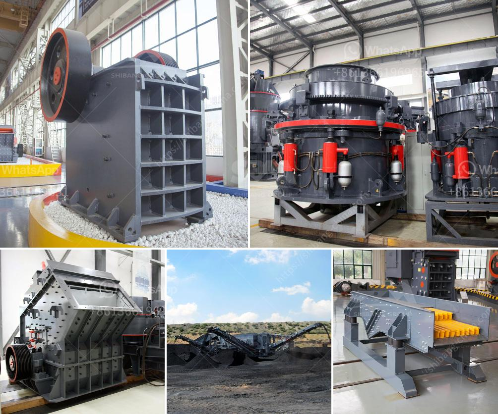

<h3>portable sand screen for rock</h3>
When it comes to construction projects involving rocks, the process of separating sand from rock particles has always been a tedious and time-consuming task. However, with recent advancements in technology, a portable sand screen has emerged as a game-changer in the industry, simplifying the process and increasing efficiency.

The primary purpose of a portable sand screen is to sieve out sand particles from rocky materials, ensuring a quality output and reducing wastage. This device consists of a sturdy frame, a vibrating screen, and a conveyor belt, all of which work seamlessly together to deliver exceptional results.

One of the key advantages of a portable sand screen is its mobility. Unlike traditional fixed sand screens, this portable device can be easily transported to different job sites, saving time and money for construction companies. With its compact design and lightweight construction, it can be transported on trucks or trailers, making it highly convenient for use in various locations.

Another significant benefit of the portable sand screen is its functionality. The vibrating screen efficiently separates the sand from the rocks by utilizing various mesh sizes. By adjusting the vibration intensity and angle, operators can achieve precise particle separation, ensuring the desired output quality. Additionally, the device's design allows for quick and easy mesh replacement, minimizing downtime and increasing productivity.

The portable sand screen also incorporates a conveyor belt, enabling the separated sand to be efficiently moved to a designated location. This eliminates the need for manual handling and ensures a smooth workflow. The conveyor belt can be adjusted to various angles and heights, allowing for easy integration with existing equipment or stockpiling solutions.

Apart from enhancing efficiency and productivity, the portable sand screen also offers environmental benefits. By effectively separating sand from rock, construction companies significantly reduce material wastage. This not only helps in conserving resources but also minimizes the environmental impact associated with the extraction and processing of materials.

Furthermore, the use of a portable sand screen promotes worker safety. By automating the process of separating sand and rocky materials, this device reduces the need for manual labor, minimizing the risk of injuries. Operators can control the device from a safe distance, ensuring a safe working environment.

In conclusion, the introduction of portable sand screens has revolutionized the construction industry. With their mobility, functionality, and environmental benefits, these devices have become a game-changer for construction projects involving rocks. Construction companies can now achieve higher productivity, better quality control, and reduced wastage all while ensuring worker safety. As this technology continues to advance, we can expect even more innovative solutions that will continue to shape the future of construction.
<h3>Contact us</h3><ul><li><strong>Whatsapp:&nbsp;<a href="https://wa.me/8613661969651">+8613661969651</a></strong></li><li><a href="https://swt.shibang-china.com/?git&amp;zhl&amp;portable sand screen for rock"><strong>Online Service(chat now)</strong></a></li></ul><h3>Related</h3><ul><li><a href='feldspar raymond mill grinding mill in low price.md'>feldspar raymond mill grinding mill in low price</a></li><li><a href='crushers i want to build a crusher.md'>crushers i want to build a crusher</a></li><li><a href='hammer mill machine buy.md'>hammer mill machine buy</a></li><li><a href='calcium carbonate machinery.md'>calcium carbonate machinery</a></li><li><a href='coal vibration equipment size.md'>coal vibration equipment size</a></li></ul>