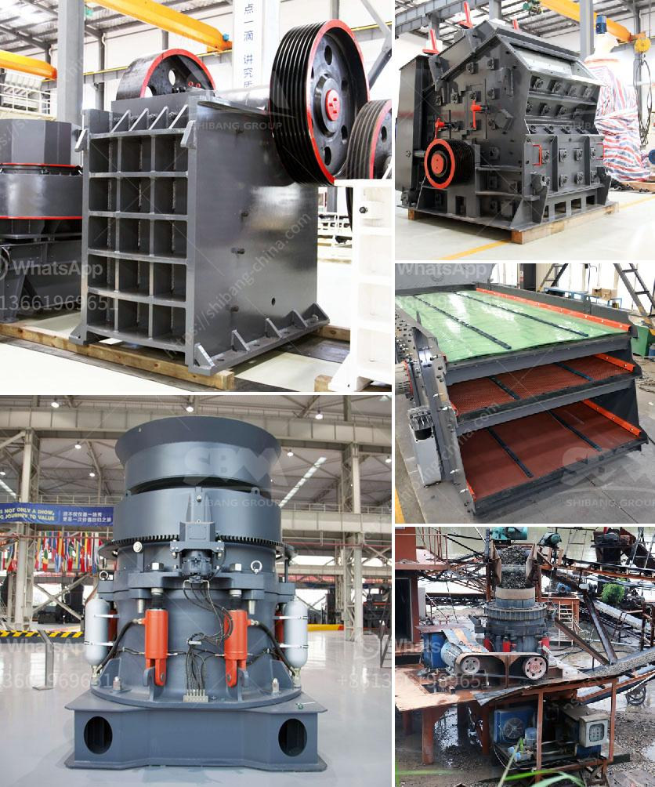

<h3>portable stone crusher machine in philippines</h3>
Portable stone crusher machine is the new type of crushing equipment that combines feeding, crushing and conveying together, which can effectively crush hard and strong granite, limestone, basalt, granite, quartz, pebble, iron ore, copper ore, etc. Portable crusher machine is widely used in mining, quarry, construction, highway and other industries. It will bring great convenience and benefits for users.

Similar to other types of crushers, portable stone crusher machines have several types as well, such as PE series jaw crusher, vertical shaft impact crusher, hydraulic cone crusher, cone crusher, hammer crusher and mobile crusher. The following is the detailed introduction of some special machines.

The PE jaw crusher is mainly used for medium-size crushing of various ores and bulk materials. It is widely used in mining, smelting, building materials, highways, railways, water conservancy and chemical industries; the highest compressive strength of the crushed materials is 320MPa.

In the crushing operation of various materials, particles with different particle sizes can be obtained according to the user's requirements by adjusting the clearance between the hammer and the counterattack plate.

Vertical shaft impact crusher is also called sand making machine. It is a kind of fine crushing machine used in the crushing process of artificial sand making plant, which can produce artificial sand aggregates with fine grain size.

The sand produced by this machine has advantages of higher crushing ratio, higher output and lower energy consumption compared to traditional sand making machines. Moreover, the sand produced by this machine is more uniform and cubical in shape.

Hydraulic cone crusher is a kind of crushing equipment that adopts hydraulic system to adjust the size of discharge opening. The materials crushed are discharged into the cone crusher through the discharging opening, and then they are gradually impacted, squeezed and bent by the moving cone and the fixed cone to crush materials.

Hydraulic cone crusher has the advantages of safety, large output, easy operation and quick adjustment of discharge opening. It is the ideal equipment for mine crushing.

The cone crusher is an advanced equipment developed by absorbing the advanced crushing technology in the world with the excellent features of high production efficiency, low operating costs and big crushing ratio. It is widely used in mining, smelting, building materials, highways, railways, water conservancy and chemical industries.

Hammer crusher is suitable for the fine crushing of limestone, coal or other medium hard brittle materials in metallurgical industry, building materials industry, chemical industry and hydropower industry. Hammer crusher has several features such as big crushing ratio, high production capacity and uniform product size.

As the industry leader, portable stone crusher machine has become the preferred equipment among many manufacturers, and its investment prospects are very promising. Users who have just invested in this field should not only proceed from their own actual situation, but also fully understand the market and choose equipment that suits them. In conclusion, portable stone crusher machine is providing more choices for customers and improving production efficiency.
<h3>Contact us</h3><ul><li><strong>Whatsapp:&nbsp;<a href="https://wa.me/8613661969651">+8613661969651</a></strong></li><li><a href="https://swt.shibang-china.com/?git&amp;zhl&amp;portable stone crusher machine in philippines"><strong>Online Service(chat now)</strong></a></li></ul><h3>Related</h3><ul><li><a href='manufacture of a cone crusher.md'>manufacture of a cone crusher</a></li><li><a href='cement grinding mills.md'>cement grinding mills</a></li><li><a href='how to build a manganese beneficiation plant.md'>how to build a manganese beneficiation plant</a></li><li><a href='jaw crusher adalah.md'>jaw crusher adalah</a></li><li><a href='manufacturer crusher machines contacts.md'>manufacturer crusher machines contacts</a></li></ul>