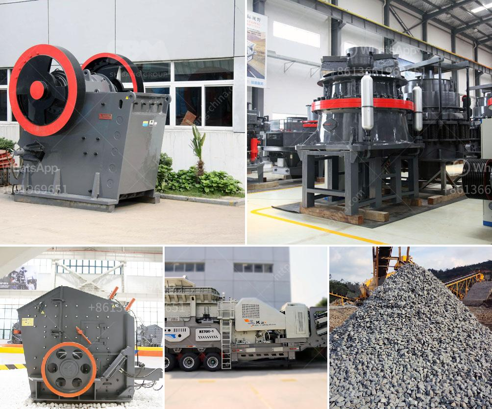

<h3>portal gold mining machine</h3>
The mining industry has always been vital for economies worldwide, supplying precious minerals and metals essential for several sectors. Recent advances in technology have brought about remarkable innovations, leading to increased efficiency and safety measures. One such groundbreaking invention is the portal gold mining machine. This state-of-the-art technology has revolutionized the industry by simplifying and streamlining the gold extraction process. In this article, we will explore the benefits and significance of portal gold mining machines.

Portal gold mining machines have transformed the conventional mining process by introducing automated features that significantly enhance operational efficiency. These machines are designed to access deep underground tunnels, efficiently excavating gold-bearing rocks and ores. Given their automated nature, they can work tirelessly round the clock, eliminating the need for human intervention and increasing productivity. With the incorporation of algorithms and sensor technologies, these machines can intelligently locate gold-rich areas, allowing for targeted extraction.

Worker safety has always been a top concern in the mining industry due to the inherent risks associated with underground operations. Portal gold mining machines address this concern by reducing the exposure of miners to hazardous environments. These machines are equipped with advanced safety features, such as remote control operation and real-time monitoring systems, minimizing the need for workers to enter potentially dangerous areas. Moreover, they are equipped with emergency response mechanisms, ensuring swift action in case of any unexpected events.

Traditional gold mining methods often have detrimental effects on the environment due to the extensive excavation and use of chemicals. However, the advent of portal gold mining machines has significantly reduced the industry's environmental impact. By effectively targeting gold-rich areas, these machines minimize the overall excavation volume required, reducing soil disturbance, deforestation, and the release of harmful chemicals into water bodies. Additionally, the automation and advanced control systems minimize resource wastage and improve mining precision.

As portal gold mining machines continue to evolve, we can expect further improvements in their speed, accuracy, and overall efficiency. However, challenges remain, such as the substantial initial investment required, operational maintenance, and the need for skilled personnel to operate and maintain these machines. Overcoming these challenges will be crucial for the widespread adoption of this revolutionary technology. Nonetheless, the potential benefits in terms of increased productivity, enhanced safety, and reduced environmental impact make portal gold mining machines an essential development in the mining industry.

The advent of portal gold mining machines has revolutionized the industry, bringing unprecedented efficiency, safety, and environmental benefits. Through automation and cutting-edge technology, these machines are streamlining the gold extraction process, targeting specific areas and reducing waste. Moreover, they mitigate the risks faced by miners and minimize harm to the environment. As this technology continues to evolve, addressing challenges and bridging skill gaps will be crucial in harnessing their full potential, paving the way for a more efficient and sustainable future in gold mining.
<h3>Contact us</h3><ul><li><strong>Whatsapp:&nbsp;<a href="https://wa.me/8613661969651">+8613661969651</a></strong></li><li><a href="https://swt.shibang-china.com/?git&amp;zhl&amp;portal gold mining machine"><strong>Online Service(chat now)</strong></a></li></ul><h3>Related</h3><ul><li><a href='dolomite ore processing.md'>dolomite ore processing</a></li><li><a href='rotary dryer machine photo.md'>rotary dryer machine photo</a></li><li><a href='impact crusher tanzania.md'>impact crusher tanzania</a></li><li><a href='gold mining equipment manufacturer china.md'>gold mining equipment manufacturer china</a></li><li><a href='gypsum calcining equipment price.md'>gypsum calcining equipment price</a></li></ul>