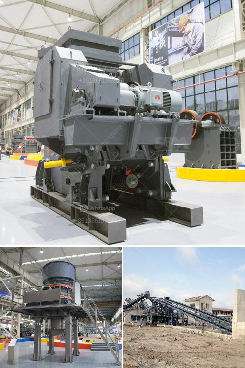

<h3>powder machinery in turkey</h3>
Turkey has emerged as a significant player in the powder machinery industry in recent years. With its strategic geographic location, skilled workforce, and advanced manufacturing capabilities, the country has become a preferred destination for companies looking to invest in powder machinery production. This article will explore Turkey's dynamic powder machinery sector and the reasons behind its rapid growth.

Powder machinery refers to equipment used in the production, processing, and packaging of various powdered substances, such as food products, chemicals, pharmaceuticals, and construction materials. The industry's expansion in Turkey can be attributed to several key factors.

Firstly, Turkey benefits from its strategic location at the crossroads of Europe, Asia, and the Middle East. This unique position allows the country to establish strong trade relations with regional and international markets. As demand for powder machinery continues to grow globally, Turkey can leverage its logistical advantages to export its products to various countries. Furthermore, it can serve as a production hub for companies targeting both regional and international customers.

Secondly, Turkey possesses a skilled and competitive workforce, particularly in the manufacturing sector. The country has a long-standing tradition of industrial production, providing a solid foundation for its machinery industry. Turkish workers are known for their craftsmanship and attention to detail, making them well-suited for the precision manufacturing techniques required in powder machinery production. Additionally, education and vocational training programs have been developed to meet industry demands, ensuring a continuous supply of skilled labor.

Moreover, Turkey's focus on research and development (R&D) has played a crucial role in the advancement of its powder machinery sector. The government has implemented policies to support innovation and technology-driven industries, which has encouraged companies to invest in R&D activities. This focus on research has led to the development of cutting-edge technologies and improved product quality within the powder machinery industry. Companies in Turkey are now able to provide state-of-the-art machinery that meets international standards, further enhancing their competitiveness in the global market.

Furthermore, Turkey's commitment to improving its infrastructure has been instrumental in the growth of the powder machinery sector. The country has made significant investments in transportation, energy, and telecommunications, enabling efficient movement of goods and fostering a business-friendly environment. Additionally, the establishment of industrial zones and specialized clusters has created synergy among various industry players, facilitating collaboration and knowledge sharing.

In conclusion, Turkey has emerged as a major player in the powder machinery industry, thanks to several key factors. Its strategic location, skilled workforce, commitment to R&D, and improved infrastructure have all contributed to the sector's rapid growth. As the demand for powder machinery continues to increase globally, Turkey's competitive advantages position it as a promising hub for production, export, and technological innovation in this industry. As the country continues to invest in its powder machinery sector, we can expect further growth and a solidification of its market position.
<h3>Contact us</h3><ul><li><strong>Whatsapp:&nbsp;<a href="https://wa.me/8613661969651">+8613661969651</a></strong></li><li><a href="https://swt.shibang-china.com/?git&amp;zhl&amp;powder machinery in turkey"><strong>Online Service(chat now)</strong></a></li></ul><h3>Related</h3><ul><li><a href='10 tph trally mounted stone crusher made in india.md'>10 tph trally mounted stone crusher made in india</a></li><li><a href='lme copper ore price calculations.md'>lme copper ore price calculations</a></li><li><a href='floatation method of analysis for silica sand.md'>floatation method of analysis for silica sand</a></li><li><a href='mobile crusher japan.md'>mobile crusher japan</a></li><li><a href='crushing plant montalban.md'>crushing plant montalban</a></li></ul>