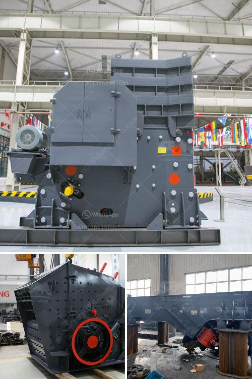

<h3>powder making machines</h3>
Powder making machines are a game-changer in the manufacturing industry, offering efficient and reliable solutions for turning various materials into fine powders. These machines are designed to crush, grind, or pulverize materials into a powdered form, which can then be used for diverse industrial applications.

One of the primary advantages of powder making machines is their ability to process a wide range of materials. Whether it is mineral ores, chemicals, food ingredients, or pharmaceuticals, these machines can handle a multitude of materials and ensure consistency in the resulting powder. This versatility makes them indispensable in industries such as mining, construction, food processing, and pharmaceutical manufacturing.

The technologies employed in powder making machines have undergone significant advancements over the years, leading to increased efficiency and precision. Modern machines utilize cutting-edge methods such as high-speed impact, grinding, or compression, optimizing the grinding process and ensuring uniform particle size distribution. These machines are designed to achieve desired particle sizes with minimal energy consumption, reducing production costs and environmental impact.

Furthermore, powder making machines contribute to improved product quality. By processing materials into finer powders, these machines enhance the homogeneity and purity of the final product. This is particularly crucial in industries that require precise proportions, such as pharmaceuticals or cosmetics.

In addition to their technical capabilities, powder making machines also offer convenience and ease of operation. Most machines come with user-friendly controls and automated features, reducing the need for extensive technical expertise. This simplification of operations enables manufacturers to streamline their production processes, saving both time and labor.

As with any industrial equipment, safety is of utmost importance when using powder making machines. Manufacturers consistently prioritize safety features to ensure secure operations. Integrated safety mechanisms and comprehensive safety guidelines minimize the risk of accidents and protect operators.

In conclusion, powder making machines have revolutionized the manufacturing industry by providing efficient, versatile, and safe solutions for converting materials into fine powders. These machines play a vital role in various sectors, contributing to improved product quality, reduced production costs, and increased productivity. As advancements in technology continue, the potential applications for powder making machines will only continue to expand, further driving progress in the manufacturing industry.
<h3>Contact us</h3><ul><li><strong>Whatsapp:&nbsp;<a href="https://wa.me/8613661969651">+8613661969651</a></strong></li><li><a href="https://swt.shibang-china.com/?git&amp;zhl&amp;powder making machines"><strong>Online Service(chat now)</strong></a></li></ul><h3>Related</h3><ul><li><a href='russia stone mining equipment.md'>russia stone mining equipment</a></li><li><a href='jaw crushers price south africa.md'>jaw crushers price south africa</a></li><li><a href='raymond mill india price.md'>raymond mill india price</a></li><li><a href='recycling machines stone production.md'>recycling machines stone production</a></li><li><a href='stone crushing machine suppliers.md'>stone +crushing +machine +suppliers</a></li></ul>