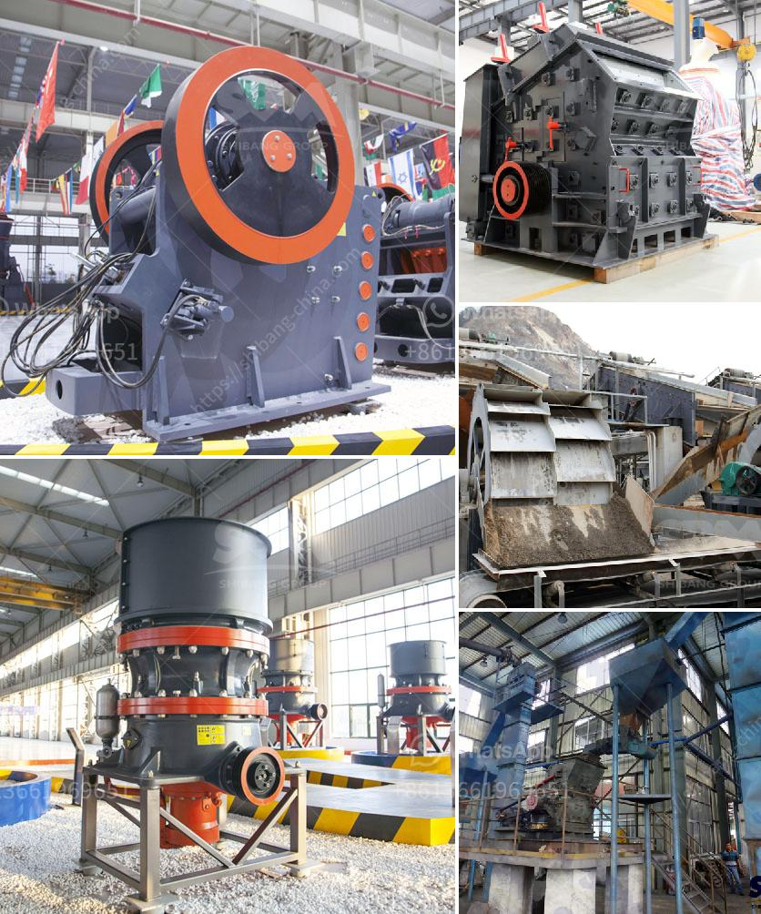

<h3>power of a roller mill</h3>
A roller mill is a type of machine used in the industrial grain processing industry to process and produce finely ground grains. These machines work by passing grains through a pair of rotating cylindrical rollers, which crush and grind the grains into smaller particles. The power of a roller mill lies in its ability to efficiently and effectively process a wide range of grains, resulting in high-quality products that meet the demands of various industries.

One of the main advantages of a roller mill is its versatility. It can process different types of grains such as wheat, barley, corn, oats, and rye. This flexibility allows manufacturers to produce a wide array of products, including flour, semolina, cracked cereals, and animal feed. The roller mill can be easily adjusted to achieve the desired particle size, providing optimal results for specific applications.

Efficiency is another key attribute of a roller mill. The rotating rollers crush the grains with precision, resulting in consistent particle size distribution. This uniformity is crucial in industries such as baking, where ingredients must be accurately measured to achieve consistent results. Roller mills also have the capacity to process large quantities of grain at a time, making them highly efficient machines for high-volume production.

In addition to efficiency, roller mills offer improved control over the final product. The gap between the rollers can be adjusted to control the coarseness or fineness of the ground grains. This level of control allows manufacturers to cater to the specific needs and preferences of their target customers. Whether it is producing fine flour for use in baking delicate pastries or coarse grains for animal feed, a roller mill can meet the unique requirements of each application.

Another advantage of a roller mill is its durability and low maintenance requirements. The rollers are typically made of high-quality materials, such as hardened steel, which can withstand the intense pressures and forces involved in grain processing. Additionally, modern roller mills are often equipped with advanced technology that monitors and regulates the grinding process, ensuring optimal performance and reducing the need for constant manual adjustments and maintenance.

The power of a roller mill extends beyond its operation within the industry. Roller mills offer environmental benefits as well. By producing finely ground grains efficiently, roller mills help reduce waste, as less grain is wasted during the processing stage. In addition, roller mills often consume less energy compared to other types of grinding machines, making them a more sustainable choice. This energy efficiency translates into cost savings for manufacturers, as well as a reduced environmental footprint.

In conclusion, the power of a roller mill lies not only in its ability to efficiently process a wide range of grains but also in its versatility, control, durability, and environmental sustainability. Whether used in the production of flour, animal feed, or other grain-based products, roller mills provide manufacturers with a reliable and efficient solution for meeting the demands of the modern industrial grain processing industry. Their consistent results, low maintenance requirements, and energy efficiency make them an integral part of grain processing operations worldwide.
<h3>Contact us</h3><ul><li><strong>Whatsapp:&nbsp;<a href="https://wa.me/8613661969651">+8613661969651</a></strong></li><li><a href="https://swt.shibang-china.com/?git&amp;zhl&amp;power of a roller mill"><strong>Online Service(chat now)</strong></a></li></ul><h3>Related</h3><ul><li><a href='accessories for chia conveyor belts.md'>accessories for chia conveyor belts</a></li><li><a href='mobile crusher in saudi.md'>mobile crusher in saudi</a></li><li><a href='south africa used chrome ore mining crushing equipment.md'>south africa used chrome ore mining crushing equipment</a></li><li><a href='custom milling for small scale mining.md'>custom milling for small scale mining</a></li><li><a href='roller mill sizes.md'>roller mill sizes</a></li></ul>