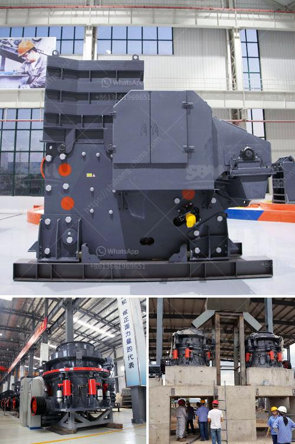

<h3>precipitated calcium carbonate production plant design</h3>
Precipitated calcium carbonate (PCC) is an innovative product derived from lime, which has many industrial applications. PCC is made by hydrating high-calcium quicklime and then reacting the resulting slurry, or “milk of lime”, with carbon dioxide. The resulting product is extremely fine with a controlled particle size distribution, making it ideal for a wide range of applications.

Designing a precipitated calcium carbonate production plant requires a detailed understanding of the end product requirements, market needs, and the various impacts on the upstream lime and CO2 sources. To efficiently design a PCC production plant, several factors must be considered:

1. Selection of raw materials: The quality and purity of lime and carbon dioxide sources will influence the final product's characteristics. It is crucial to source high-quality quicklime and CO2 to ensure consistent and reliable PCC production.

2. Reactor design: The reaction between lime and carbon dioxide takes place in a reactor, where the slurry is continuously mixed to ensure uniform distribution of CO2 throughout the process. The reactor design must optimize the reaction kinetics, maximizing the conversion of lime to PCC while minimizing energy consumption.

3. Particle size control: The particle size distribution of PCC is a critical factor that determines its suitability for different applications. The plant design should incorporate systems to control and monitor particle size, ensuring the desired specifications are met consistently. This may involve post-reaction processes such as milling and classification.

4. Waste management: PCC production generates waste streams that need to be properly managed. Byproducts such as lime mud and CO2 emissions should be effectively treated and mitigated to minimize their impact on the environment. Designing an efficient waste management system can enhance the sustainability and economic viability of the plant.

5. Automation and process control: Implementing advanced control systems can optimize the production process, improving product quality and reducing operational costs. Automated control systems can continuously monitor and adjust process variables, ensuring optimal reaction conditions and minimizing product defects.

6. Scalability and flexibility: The plant design should consider future expansion and the ability to adapt to changing market demands. Scalable solutions allow for increased production capacity while maintaining product quality. Additionally, a flexible design allows for the production of different grades and formulations of PCC to cater to a diverse customer base.

7. Energy efficiency: Designing a PCC production plant with energy efficiency in mind can reduce operating costs and environmental impact. Implementing energy recovery systems, heat integration, and optimized process layouts can enhance the overall energy efficiency of the plant.

In conclusion, designing a precipitated calcium carbonate production plant requires a comprehensive understanding of the product requirements, raw materials, and market demands. Attention to details such as raw material selection, reactor design, particle size control, waste management, automation, scalability, and energy efficiency are crucial to the success of the plant. By incorporating these considerations into the design process, manufacturers can optimize production efficiency, meet market demands, and achieve sustainable operations.
<h3>Contact us</h3><ul><li><strong>Whatsapp:&nbsp;<a href="https://wa.me/8613661969651">+8613661969651</a></strong></li><li><a href="https://swt.shibang-china.com/?git&amp;zhl&amp;precipitated calcium carbonate production plant design"><strong>Online Service(chat now)</strong></a></li></ul><h3>Related</h3><ul><li><a href='turkey ball mill company.md'>turkey ball mill company</a></li><li><a href='toggle jaw crusher.md'>toggle jaw crusher</a></li><li><a href='application of hammer mill.md'>application of hammer mill</a></li><li><a href='used portable crusher for sale in germany.md'>used portable crusher for sale in germany</a></li><li><a href='cocount crushing manchine.md'>cocount crushing manchine</a></li></ul>