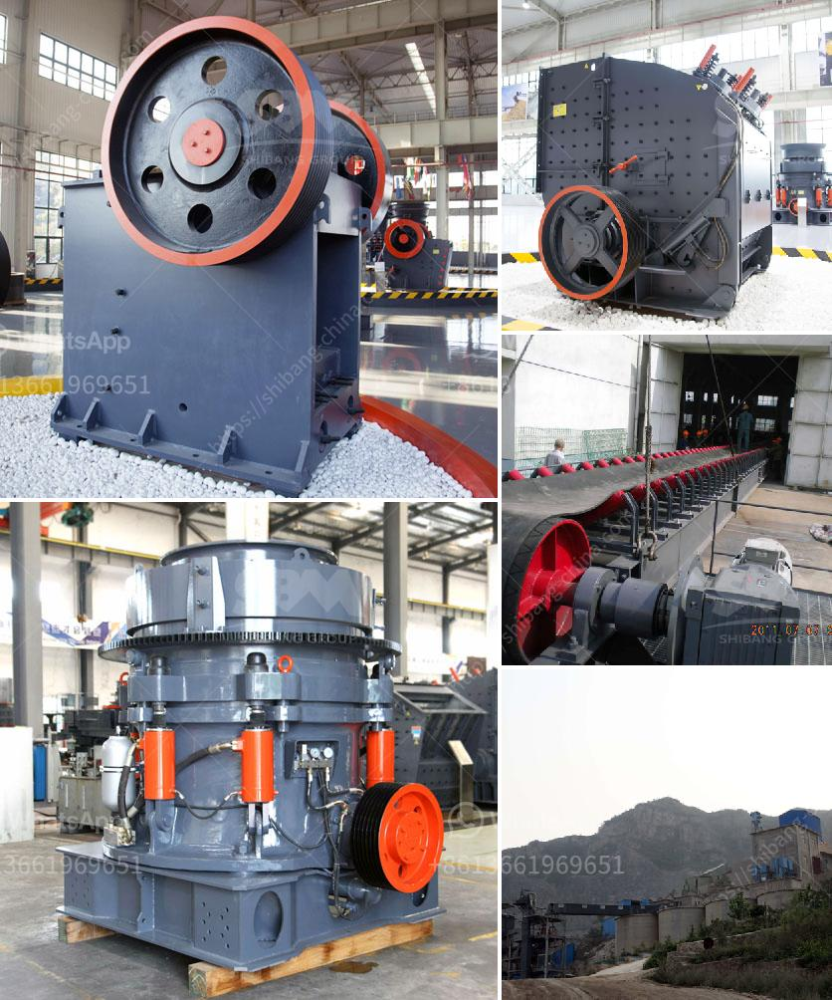

<h3>price and 900 stone crusher</h3>
The development of material crushing is an ancient task that has undergone different stages of perfection over time. In its early days, the stone crusher was a hand-held device, a primitive tool utilized by early humans to break ores and rocks into smaller pieces. In the modern era, industrialization has paved the way for the emergence of highly efficient crushers that can handle large quantities of materials. One such innovation is the 900 stone crusher.

The 900 stone crusher is a mechanized device that is designed to break stones and rocks into smaller pieces. It is capable of crushing stones of various sizes with ease, making it an ideal solution for the construction industry. This powerful machine utilizes a strong jaw design to crush the material efficiently. Its robust construction allows it to withstand heavy-duty tasks, making it suitable for even the most demanding jobs.

When considering the price of a 900 stone crusher, several factors come into play. The brand and reputation of the manufacturer are significant influencers. Well-established manufacturers that have been producing crushers for years often command higher prices due to their proven track record of quality and reliability. On the other hand, lesser-known brands may offer lower prices to compete in the market, but they may lack the same level of durability and performance.

Additionally, the specifications and features of the machine will also affect the price. A 900 stone crusher equipped with advanced technology and additional functionalities, such as automation and remote control, will be priced higher compared to a basic model. These added features can enhance productivity, reduce labor costs, and provide a more user-friendly experience, making them a worthwhile investment.

Another factor to consider when determining the price of a 900 stone crusher is the market demand and availability of similar products. If there is high demand for this type of crusher, the price may be higher due to limited supply. Conversely, if there are many options available in the market, manufacturers may lower their prices to attract buyers.

The range of prices for a 900 stone crusher may vary widely. On average, you can expect to pay around $50,000 to $100,000 for a high-quality machine. However, there may be variations depending on the factors mentioned earlier. It is important to evaluate the specific needs of your project and carefully consider the features, specifications, and reputation of the manufacturer before making a purchase decision.

In conclusion, the 900 stone crusher is a powerful and efficient machine that can break stones and rocks into smaller pieces. When considering the price of this equipment, factors such as the brand, reputation, specifications, features, market demand, and availability come into play. Investing in a high-quality 900 stone crusher can provide long-term benefits for the construction industry, enhancing productivity and efficiency in material crushing tasks.
<h3>Contact us</h3><ul><li><strong>Whatsapp:&nbsp;<a href="https://wa.me/8613661969651">+8613661969651</a></strong></li><li><a href="https://swt.shibang-china.com/?git&amp;zhl&amp;price and 900 stone crusher"><strong>Online Service(chat now)</strong></a></li></ul><h3>Related</h3><ul><li><a href='mobile crusher plant for sale.md'>mobile crusher plant for sale</a></li><li><a href='kenya cement plant.md'>kenya cement plant</a></li><li><a href='machinery for quartz stone.md'>machinery for quartz stone</a></li><li><a href='chromite beneficiation plant in malaysia.md'>chromite beneficiation plant in malaysia</a></li><li><a href='to do with the stone crusher.md'>to do with the stone crusher</a></li></ul>