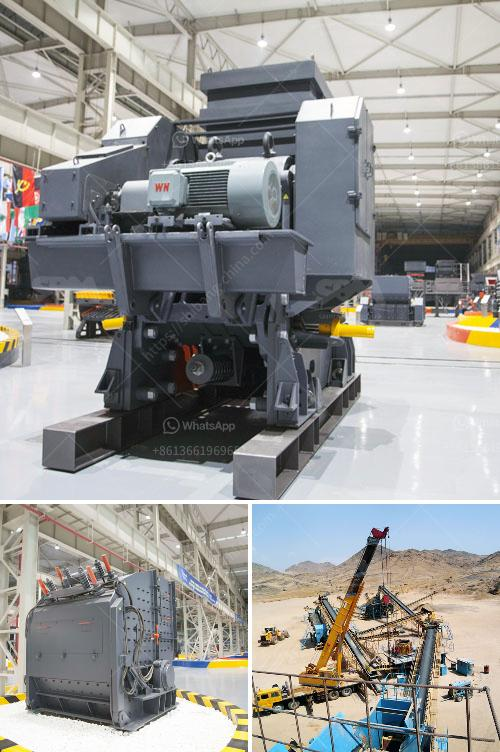

<h3>price for vsi crusher</h3>
The price of VSI crusher is influenced by various factors, including the production capacity, material properties, and manufacturers. With the increasing demand for high-quality sand and gravel aggregate, manufacturers are continuously improving the performance of VSI crusher, which has brought a wider range of applications to this equipment.

VSI crusher, as a kind of sand making machine, manufactures high-quality artificial sand by utilizing the "stone-to-stone" crushing method. Compared with traditional sand making machines, VSI crusher has more advantages in terms of unique structure, strong wear resistance, and excellent grain shape performance. These advantages make it widely used in various engineering fields such as water conservancy, construction, and highway.

When it comes to the price of VSI crusher, it varies greatly based on the different specifications and models. Generally speaking, the price range of VSI crusher is from around $10,000 to $100,000. The price mainly depends on the production capacity and the configuration of the equipment. For example, a VSI-5X series sand making machine with a capacity of 100 tons per hour is more expensive than a VSI-3X series sand making machine with a capacity of 30 tons per hour.

In addition to the production capacity and configuration, the brand and after-sales service of the manufacturer also affect the price of VSI crusher. Well-known brands often have higher prices due to their good reputation and reliable quality assurance. Furthermore, the after-sales service provided by the manufacturer, such as maintenance and technical support, also affects the overall cost.

To sum up, the price of VSI crusher is influenced by multiple factors, including production capacity, configuration, brand, and after-sales service. Therefore, customers should carefully analyze their actual needs and choose the most suitable VSI crusher with a reasonable price-performance ratio. Comparing different manufacturers and understanding their after-sales service can help customers make a wise and cost-effective decision.
<h3>Contact us</h3><ul><li><strong>Whatsapp:&nbsp;<a href="https://wa.me/8613661969651">+8613661969651</a></strong></li><li><a href="https://swt.shibang-china.com/?git&amp;zhl&amp;price for vsi crusher"><strong>Online Service(chat now)</strong></a></li></ul><h3>Related</h3><ul><li><a href='coal dryer manufacturer india.md'>coal dryer manufacturer india</a></li><li><a href='ball grinding mill.md'>ball grinding mill</a></li><li><a href='ball mill quartz.md'>ball mill quartz</a></li><li><a href='stone crushing production process.md'>stone crushing production process</a></li><li><a href='balls in cement grinding.md'>balls in cement grinding</a></li></ul>