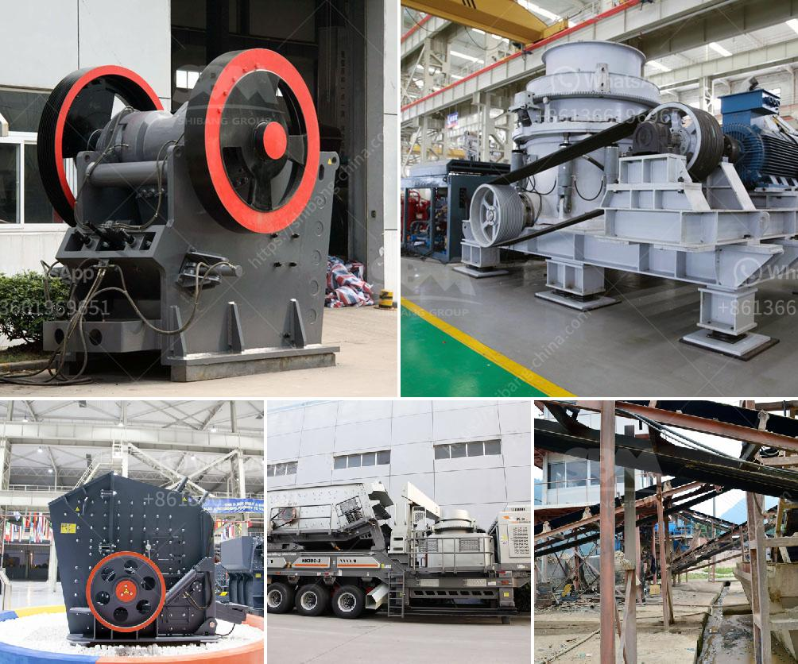

<h3>price hammer crusher in nigeria</h3>
The price of hammer crusher is influenced by many factors. Different manufacturers of different types of hammer crusher will give different quotes. It is recommended that you come to our company for inspection. Our company is currently a professional manufacturer of hammer crushers in China. Factory prices are more favorable. Third, the greater the number of manufacturers, the more common the distribution There are numerous suppliers, and the supply of hammer crushers on the market is uncertain. The model of equipment production capacity also determines the price of the hammer crusher. The capacity of the equipment produced by different manufacturers is different, and the price is also different. If you want to know more about the hammer crusher, please consult our online customer service.
<h3>Contact us</h3><ul><li><strong>Whatsapp:&nbsp;<a href="https://wa.me/8613661969651">+8613661969651</a></strong></li><li><a href="https://swt.shibang-china.com/?git&amp;zhl&amp;price hammer crusher in nigeria"><strong>Online Service(chat now)</strong></a></li></ul><h3>Related</h3><ul><li><a href='bauxite crusher machine.md'>bauxite crusher machine</a></li><li><a href='gypsum mining crusher in kenya manufacturer.md'>gypsum mining crusher in kenya manufacturer</a></li><li><a href='roller mill from china.md'>roller mill from china</a></li><li><a href='stone crusher uk.md'>stone crusher uk</a></li><li><a href='portal gold mining machine.md'>portal gold mining machine</a></li></ul>