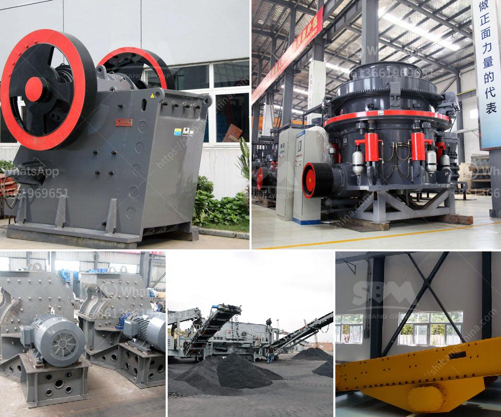

<h3>price list of stone crusher plant</h3>
A stone crusher plant, as the name implies, is used for crushing stone, including limestone, granite, basalt, river stone and so on. It is the necessary equipment in construction, mining and other industries. So, what are the price ranges for different types of stone crusher plants?

First of all, stone crusher plants are mainly divided into two types: stationary and mobile. The stationary stone crushing plant requires a specific field, so you need to transport the finished product to the designated area. The mobile crushing plant, on the other hand, is portable and easy to move around. It does not require any special infrastructure, making it suitable for any construction site.

The price of a stone crusher plant varies depending on the type of construction site, mobile or stationary, and its capacity. Different capacities of stone crusher plants are available, so you can choose the one that suits your needs. The following are some factors that affect the price of a stone crusher plant:

2. Size of raw materials: The size of the raw materials determines the size of the crusher required. If the raw materials are large, a larger crusher will be needed, which will increase the overall cost.

3. Transport distance: The distance between the quarry and the construction site also affects the price. The longer the distance, the higher the transportation cost and subsequently, the higher the price of the stone crusher plant.

4. Equipment configuration: Different equipment configurations have different prices. The more advanced the equipment, the higher the price. For example, if the plant is equipped with a vibrating feeder, jaw crusher, impact crusher, vibrating screen, belt conveyor, and other auxiliary equipment, the price will be higher.

In conclusion, the price range of a stone crusher plant varies greatly depending on the specific needs of the customer. You can contact a reputable supplier for a detailed quotation based on your requirements. It is important to compare multiple suppliers to ensure you get the best value for your money.
<h3>Contact us</h3><ul><li><strong>Whatsapp:&nbsp;<a href="https://wa.me/8613661969651">+8613661969651</a></strong></li><li><a href="https://swt.shibang-china.com/?git&amp;zhl&amp;price list of stone crusher plant"><strong>Online Service(chat now)</strong></a></li></ul><h3>Related</h3><ul><li><a href='18tph roll mill process.md'>18tph roll mill process</a></li><li><a href='lime and dolomite plant in india.md'>lime and dolomite plant in india</a></li><li><a href='cement plant for sale south africa.md'>cement plant for sale south africa</a></li><li><a href='limestone production process.md'>limestone production process</a></li><li><a href='stone crushers fron china.md'>stone crushers fron china</a></li></ul>