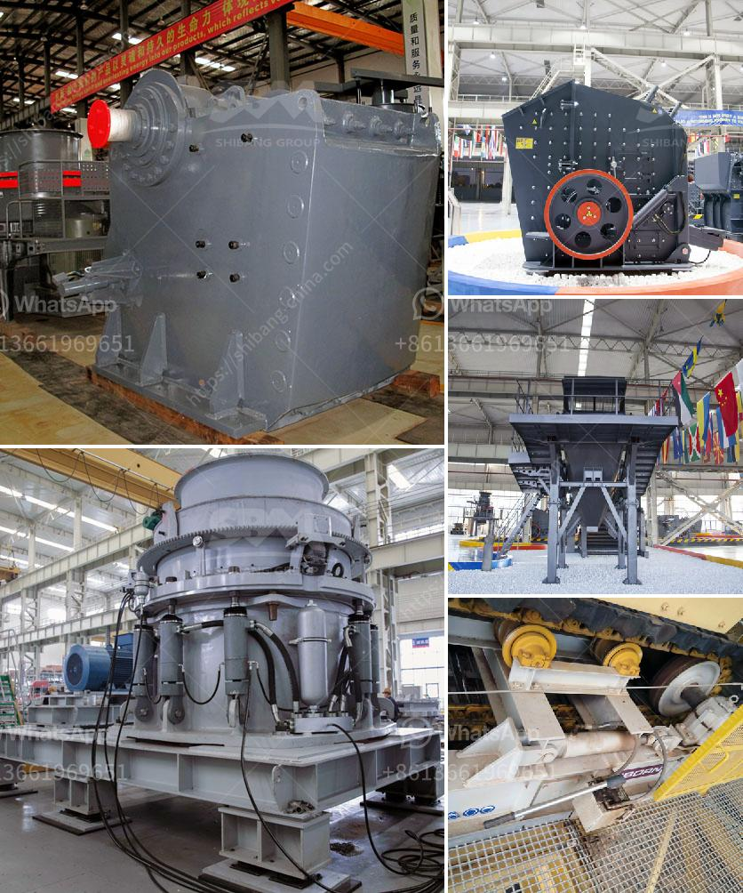

<h3>price of artificial sand mill</h3>
In the era of technological advancements, industries across the globe are constantly searching for ways to improve efficiency and productivity. One of the key elements that can significantly impact these factors is the choice of machinery and equipment. A crucial tool that has revolutionized many industries is the artificial sand mill, and its price is a topic of interest for all those involved.

Artificial sand mills are used for grinding and dispersing materials like paints, pigments, dyes, ceramics, and minerals. These machines play a vital role in reducing particle size, ensuring proper mixing and dispersion, and facilitating high-quality end products. Without the availability of such mills, numerous industries would face challenges in achieving desired outcomes.

When considering the price of an artificial sand mill, several factors come into play. Firstly, the specifications and features of the mill greatly affect its cost. Mills with higher processing capacities or enhanced functionalities generally carry a higher price tag. Manufacturers often offer various models with different specifications to cater to the diverse needs of different industries.

Secondly, the materials used in the construction of artificial sand mills contribute significantly to their pricing. Robust mills with durable components tend to be costly, but they ensure a longer lifespan and withstand harsh operating conditions. Manufacturers employ high-quality materials that are resistant to wear and tear, ensuring consistent performance over time.

Furthermore, the level of automation and technological advancement is yet another factor influencing the price of artificial sand mills. With the advent of Industry 4.0, manufacturers have introduced smart mills equipped with advanced control systems, sensors, and automated features. These mills offer increased precision, efficiency, and reduced human intervention, ultimately improving productivity. However, the integration of such technologies requires additional investment, leading to a higher price for these mills.

Demand and supply dynamics also play a crucial role in determining the price of artificial sand mills. When the demand for these mills outweighs the supply, manufacturers tend to increase the price to maximize their profits. Conversely, during periods of low demand, prices may be reduced to maintain competitiveness in the market. It is essential for industries to keep a close eye on the market dynamics to make informed decisions about investing in artificial sand mills.

Investing in an artificial sand mill can yield numerous benefits for industries. By reducing processing time, improving product quality, and ensuring uniform particle sizes, these mills enhance overall efficiency and productivity. Industries such as paints, coatings, ceramics, and minerals rely heavily on the capabilities of artificial sand mills to achieve their desired outcomes. Therefore, the price associated with these mills is a small investment compared to the long-term benefits they offer.

In conclusion, the price of an artificial sand mill is influenced by various factors, including specifications, materials used, technological advancements, and market demand. However, the overall impact it has on the efficiency and productivity of industries is undeniable. Investing in high-quality mills that align with specific requirements can lead to substantial returns in terms of improved performance and profitability. As industries continue to evolve, artificial sand mills will remain an essential tool, and their price will continue to be a topic of interest for all industry stakeholders.
<h3>Contact us</h3><ul><li><strong>Whatsapp:&nbsp;<a href="https://wa.me/8613661969651">+8613661969651</a></strong></li><li><a href="https://swt.shibang-china.com/?git&amp;zhl&amp;price of artificial sand mill"><strong>Online Service(chat now)</strong></a></li></ul><h3>Related</h3><ul><li><a href='impact crusher discount.md'>impact crusher discount</a></li><li><a href='stone crusher price in australia.md'>stone crusher price in australia</a></li><li><a href='equipment for a mini quarry plant.md'>equipment for a mini quarry plant</a></li><li><a href='silica sand washing machine.md'>silica sand washing machine</a></li><li><a href='ultra white silica processing.md'>ultra white silica processing</a></li></ul>