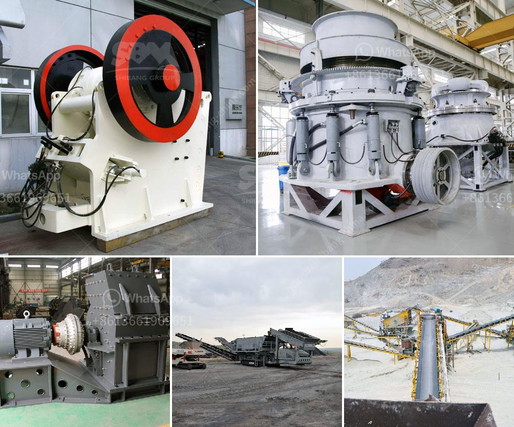

<h3>price of ballast crusher per ton in kenya</h3>
In Kenya, gravel crushers are always the hottest equipment in the market. With its foundation on ballast, it has proven to be remarkably reliable in ensuring the ongoing viability of rail operations. However, how much does a ballast crusher per ton cost in Kenya?

To provide a rough estimate, one can consider the following aspects: First, the price of raw materials. Raw materials, namely sand and gravel, play a vital role in the construction industry. In order to be processed into high-quality ballast, they are selected and crushed rigorously. However, the quality requirements of raw materials vary from manufacturer to manufacturer. For instance, the stone used for railway ballast must be hard, durable, and able to resist weathering, while the sand used requires a particle size distribution to match specific requirements. Consequently, the price of raw materials will influence the overall cost.

Second, the processing capacity of the ballast crusher. The hardness and strength of the slab will also affect the overall cost. If the ballast is too hard, it will take a long time to crush and the capacity of the crusher will be reduced. On the contrary, if the ballast is too soft, it may not meet the required specifications. Therefore, it is crucial to select a ballast crusher with appropriate processing capacity and efficiency.

Third, the model of the ballast crusher. Different models have different prices. Generally speaking, the larger the model, the higher the price. The reason behind this is that larger models often have higher production capacity and higher working efficiency, which helps to reduce production costs in the long run. Therefore, it is essential to choose a model that matches the expected workload.

Finally, market competition plays a significant role in determining the price of ballast crushers. In Kenya, there are multiple manufacturers of ballast crushers, each with different production capabilities and cost structures. As a result, the market is highly competitive, driving manufacturers to offer competitive prices to attract customers. By comparing prices from different manufacturers, customers can find the most cost-effective option.

Based on all these factors, it is not easy to provide a precise estimation of the price of a ballast crusher per ton in Kenya. However, it is safe to say that it generally ranges from thousands to tens of thousands of dollars. Ultimately, it depends on the specific requirements, processing capacity, and competitiveness of the market.

In conclusion, when considering the price of a ballast crusher per ton in Kenya, several factors come into play. These include the price of raw materials, processing capacity, model, and market competition. By carefully evaluating these factors, customers can make informed decisions and find the most cost-effective option.
<h3>Contact us</h3><ul><li><strong>Whatsapp:&nbsp;<a href="https://wa.me/8613661969651">+8613661969651</a></strong></li><li><a href="https://swt.shibang-china.com/?git&amp;zhl&amp;price of ballast crusher per ton in kenya"><strong>Online Service(chat now)</strong></a></li></ul><h3>Related</h3><ul><li><a href='hammer mills price.md'>hammer mills price</a></li><li><a href='calcite manufacturing.md'>calcite manufacturing</a></li><li><a href='hammer mill pc800 x 600.md'>hammer mill pc800 x 600</a></li><li><a href='cost of starting a small gold mine zimbabwe.md'>cost of starting a small gold mine zimbabwe</a></li><li><a href='graphite processing and beneficiation.md'>graphite processing and beneficiation</a></li></ul>