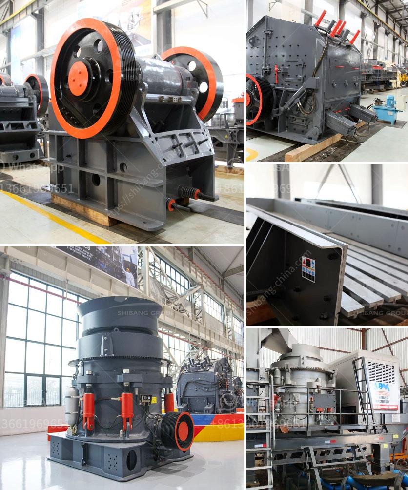

<h3>price of gold mining equipment</h3>
Gold mining has been one of the most lucrative and sought-after activities for centuries. As the demand for gold continues to rise, so does the need for efficient and reliable gold mining equipment. However, the price of such equipment can vary greatly, depending on various factors. In this article, we will explore some of the key factors that influence the price of gold mining equipment.

1. Quality and Performance: One of the primary factors that determine the price of gold mining equipment is the quality and performance of the machinery. High-quality equipment with advanced technology and features can significantly enhance the efficiency and productivity of gold mining operations. Therefore, such equipment tends to be more expensive compared to basic or outdated models.

2. Size and Capacity: The size and capacity of the equipment also play a vital role in determining its price. Larger and more powerful equipment, such as high-capacity wash plants or gold dredges, require more materials, engineering, and manufacturing processes, resulting in higher costs. Moreover, larger equipment often requires specialized transportation and setup, which can also add to the overall price.

3. Customization and Upgrades: Gold mining operations vary in terms of geographical location, deposit characteristics, and processing requirements. Therefore, some mining companies may require customized equipment or specific upgrades to meet their unique needs. Customized or upgraded equipment typically comes at a higher price due to additional design, engineering, and manufacturing processes involved.

4. Brand Reputation: The reputation and brand strength of a manufacturer also influence the price of gold mining equipment. Well-established and reputable brands often command a premium due to their proven track record of delivering high-quality and reliable equipment. Customers are willing to pay extra for the peace of mind that comes with using trusted and reputable brands in their mining operations.

5. Market Demand: Like any other commodity, the price of gold mining equipment can be influenced by market demand. If the demand for mining equipment is high, manufacturers may increase prices to capitalize on the surge in demand. Conversely, during periods of low demand, manufacturers may lower prices to stimulate interest and boost sales.

6. Raw Material Costs: The cost of raw materials, such as steel, aluminum, and copper, used in the production of mining equipment also impact its price. Fluctuations in these raw material prices can have a significant effect on the final cost of the equipment. Additionally, global factors like trade policies, supply chain disruptions, or changes in currency exchange rates can further influence raw material prices and, consequently, the cost of mining equipment.

7. After-sales Support and Service: Apart from the initial purchase cost of the equipment, customers also consider after-sales support and service when evaluating the overall value. Manufacturers offering comprehensive warranties, technical support, spare parts availability, and onsite training may charge a premium for these added benefits.

In conclusion, the price of gold mining equipment can vary based on several factors including quality and performance, size and capacity, customization and upgrades, brand reputation, market demand, raw material costs, and after-sales support. Prospective gold mining operators must carefully evaluate these factors to determine the ideal balance between price and quality that suits their specific needs and budget.
<h3>Contact us</h3><ul><li><strong>Whatsapp:&nbsp;<a href="https://wa.me/8613661969651">+8613661969651</a></strong></li><li><a href="https://swt.shibang-china.com/?git&amp;zhl&amp;price of gold mining equipment"><strong>Online Service(chat now)</strong></a></li></ul><h3>Related</h3><ul><li><a href='grinding plant in rajasthan.md'>grinding plant in rajasthan</a></li><li><a href='calcium carbonate crushers.md'>calcium carbonate crushers</a></li><li><a href='mobile vibrating screen for iron.md'>mobile vibrating screen for iron</a></li><li><a href='old stone crusher for sale.md'>old stone crusher for sale</a></li><li><a href='jual jaw crusher bekas surabaya.md'>jual jaw crusher bekas surabaya</a></li></ul>