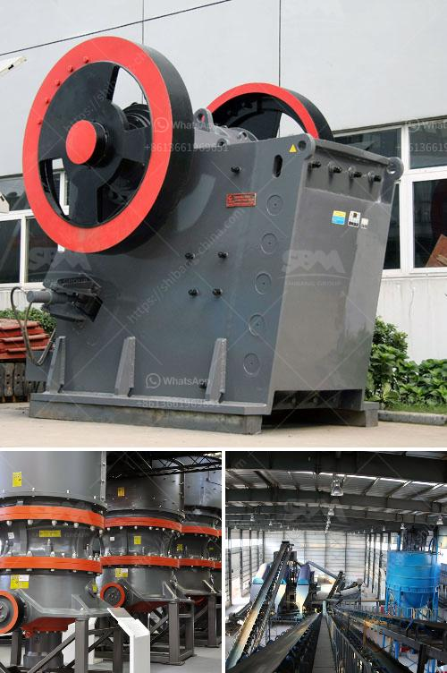

<h3>price of grinder machine in malaysia</h3>
The price of a grinding machine in Malaysia has always been a debatable topic. With the wide array of different models and manufacturers available, it can be challenging to find the right machine for your needs at the right price. In this article, we will discuss the factors that influence the pricing of grinding machines in Malaysia and provide some insights into the average prices you can expect to pay.

One of the primary factors that affect the price of a grinder machine is its functionality and features. Grinding machines come in a variety of types, including surface grinders, cylindrical grinders, and tool and cutter grinders. Each type offers different functionalities, such as precision grinding, surface finishing, or specific tool sharpening capabilities. The more features and functionalities a grinder machine offers, the higher its price is likely to be.

Another factor influencing the price is the overall build quality and durability of the machine. Machines made with higher-quality materials and better construction are generally more expensive but offer a longer lifespan and better performance. It is advisable to consider a grinder machine made by a reputable manufacturer to ensure you are getting good value for your money.

The specifications of the grinding machine also have a significant impact on its price. Factors such as grinding wheel size, motor power, and spindle speed can influence the machine's productivity and the types of materials it can handle. Machines with larger grinding wheels, higher motor power, and faster spindle speeds tend to be pricier due to their increased capabilities and efficiency.

Additionally, the market demand and supply dynamics play a role in determining the prices of grinding machines in Malaysia. If there is a high demand for grinding machines but a limited supply, the prices are likely to be higher. On the other hand, if there is a surplus supply of machines in the market, prices may be more competitive. Therefore, it is essential to monitor the market trends and compare prices from different sellers to ensure you are getting a fair deal.

The price range of grinding machines in Malaysia can vary significantly based on the factors mentioned above. On average, you can expect to pay anywhere between RM300 to RM500 for a basic entry-level grinder machine. These machines typically offer standard functionalities and are suitable for light-duty tasks. However, if you require a more advanced grinder machine with additional features and capabilities, you may need to spend upwards of RM1000.

In conclusion, the price of a grinder machine in Malaysia is influenced by its functionalities, build quality, specifications, and market dynamics. To find the right machine at the right price, it is essential to assess your specific needs and budget, research different models and manufacturers, and compare prices from multiple sellers. By doing so, you can ensure you get the best value for your money and find a grinder machine that meets your requirements.
<h3>Contact us</h3><ul><li><strong>Whatsapp:&nbsp;<a href="https://wa.me/8613661969651">+8613661969651</a></strong></li><li><a href="https://swt.shibang-china.com/?git&amp;zhl&amp;price of grinder machine in malaysia"><strong>Online Service(chat now)</strong></a></li></ul><h3>Related</h3><ul><li><a href='price list of stone crusher plant.md'>price list of stone crusher plant</a></li><li><a href='small scale mining rock crushers for sale.md'>small scale mining rock crushers for sale</a></li><li><a href='quartz rock processing equipment.md'>quartz rock processing equipment</a></li><li><a href='300 tone per hour limestone crusher.md'>300 tone per hour limestone crusher</a></li><li><a href='grinding mill gold ore.md'>grinding mill gold ore</a></li></ul>