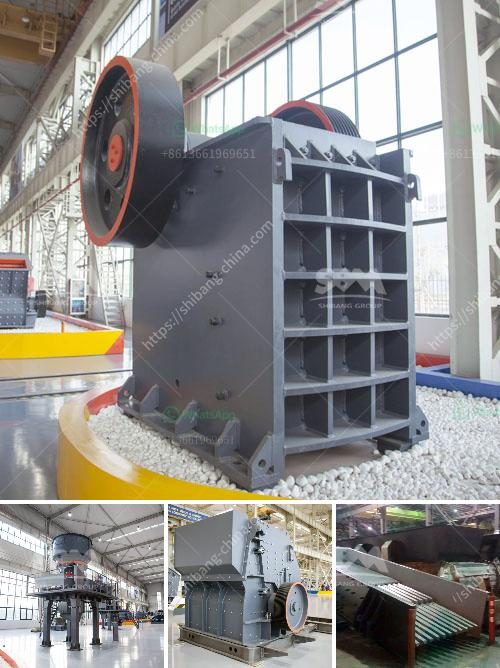

<h3>price of roller crusher</h3>
Roller crushers, also known as smooth roll crushers, are commonly used in industries and mining operations for primary crushing of materials. These crushers have two parallel cylindrical rollers that rotate in opposite directions to crush the material between them. The price of roller crushers can vary significantly depending on various factors such as the capacity, size, and specific requirements of the application. In this article, we will explore the factors influencing the price of roller crushers and help you determine whether you are paying a fair amount.

One of the main factors that affect the price of roller crushers is the capacity. Roller crushers are available in different capacities ranging from a few tons per hour to several hundred tons per hour. Higher capacity roller crushers are generally more expensive due to the larger and more robust construction required to handle larger quantities of material. Therefore, it is crucial to assess your specific needs and choose a roller crusher with an optimal capacity that meets your production requirements.

Another factor that impacts the price of roller crushers is the size of the machine. Roller crushers come in various sizes, and the larger the machine, the higher the price. The size of the roller crusher is determined by the diameter and length of the rollers. Larger rollers generally offer higher throughput and can handle larger feed sizes, which makes them suitable for heavy-duty applications. However, smaller roller crushers can be more cost-effective for applications with lower capacity requirements.

The specific requirements of your application can also influence the price of roller crushers. Certain industries or materials may require additional features or modifications to the roller crusher, such as special wear-resistant coatings or customized feeding arrangements. These enhancements can increase the price of the machine. It is essential to communicate your specific requirements with the manufacturer or supplier to ensure you get an accurate price estimate.

Aside from the aforementioned factors, the brand and reputation of the manufacturer can also affect the price of roller crushers. Well-established and reputable manufacturers often charge a premium for their products due to the trusted quality and reliability they offer. While opting for a well-known brand can provide assurance in terms of performance and customer support, it is also advisable to consider lesser-known manufacturers that offer competitive pricing without compromising on quality.

When evaluating the price of roller crushers, it is crucial to consider the overall value proposition rather than solely focusing on the initial cost. The durability, efficiency, and maintenance requirements of the machine are vital aspects to factor in. A cheaper roller crusher may require frequent repairs or have higher energy consumption, which can negatively impact your productivity and overall cost of operation in the long run. Therefore, it is essential to strike a balance between the initial cost and the anticipated durability and efficiency of the machine.

In conclusion, the price of roller crushers can vary depending on several factors such as capacity, size, specific requirements, and brand reputation. When evaluating the price, it is essential to consider your specific needs, assess the overall value proposition, and compare multiple options from different manufacturers or suppliers. By doing so, you can ensure that you are paying a fair amount for a roller crusher that meets your production requirements and provides long-term value for your investment.
<h3>Contact us</h3><ul><li><strong>Whatsapp:&nbsp;<a href="https://wa.me/8613661969651">+8613661969651</a></strong></li><li><a href="https://swt.shibang-china.com/?git&amp;zhl&amp;price of roller crusher"><strong>Online Service(chat now)</strong></a></li></ul><h3>Related</h3><ul><li><a href='stone crusher jaw mini produksi indonesia.md'>stone crusher jaw mini produksi indonesia</a></li><li><a href='stone crusher plant set up procedure.md'>stone crusher plant set up procedure</a></li><li><a href='how to maintain stone crusher daily accounts in tally.md'>how to maintain stone crusher daily accounts in tally</a></li><li><a href='mobile crusher plant for sale.md'>mobile crusher plant for sale</a></li><li><a href='cement plant price in pakistan.md'>cement plant price in pakistan</a></li></ul>