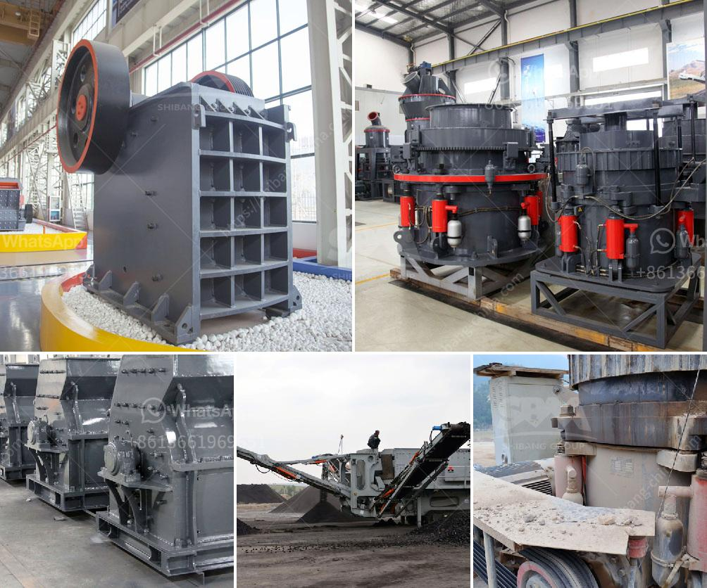

<h3>price of roller crushers in usa</h3>
Roller crushers are essential equipment in various industries such as mining, construction, and metallurgy. They are commonly used to crush and grind materials into smaller particles, making them easier to handle or process. However, the price of roller crushers in the United States varies depending on several factors.

Firstly, the brand and model of the roller crusher greatly influence its price. Established and renowned brands often come with a higher price tag due to their reputation, quality, and reliability. On the other hand, lesser-known brands may offer more affordable options but could compromise on durability and performance.

Secondly, the size and capacity of the roller crusher impact its price. Roller crushers come in different sizes, ranging from small machines suitable for laboratory use to large industrial crushers capable of handling tons of material per hour. Generally, larger crushers with higher capacities are more expensive due to their complex design and enhanced production capabilities.

Moreover, the features and specifications of the roller crusher affect its price. Innovative features such as adjustable settings, multiple crushing stages, and automated controls can increase the cost. Additionally, specific industry requirements may demand additional customization, resulting in a higher price.

Furthermore, the supplier or distributor also plays a significant role in determining the price. Different vendors may have varying profit margins and sourcing strategies that influence the final cost. It is advisable to research and compare prices from different suppliers to ensure a competitive price.

Lastly, market conditions and demand can impact roller crusher prices in the USA. Factors such as raw material costs, transportation expenses, and economic trends can all influence the overall pricing. It is essential to stay updated on market dynamics to make informed purchasing decisions.

In conclusion, the price of roller crushers in the USA is influenced by various factors, including the brand, model, size, features, supplier, and market conditions. It is important for buyers to consider these factors and assess their specific needs to find the most suitable and cost-effective roller crusher for their applications. Conducting thorough market research and seeking multiple quotations from different suppliers can help in obtaining the best price without compromising on quality and performance.
<h3>Contact us</h3><ul><li><strong>Whatsapp:&nbsp;<a href="https://wa.me/8613661969651">+8613661969651</a></strong></li><li><a href="https://swt.shibang-china.com/?git&amp;zhl&amp;price of roller crushers in usa"><strong>Online Service(chat now)</strong></a></li></ul><h3>Related</h3><ul><li><a href='100tph stationery stone crushing plant.md'>100tph stationery stone crushing plant</a></li><li><a href='sewa stone crusher di jakarta.md'>sewa stone crusher di jakarta</a></li><li><a href='coal crusher design.md'>coal crusher design</a></li><li><a href='gypsum crusher plants in india.md'>gypsum crusher plants in india</a></li><li><a href='diesel engine stone crusher small for quarry project.md'>diesel engine stone crusher small for quarry project</a></li></ul>