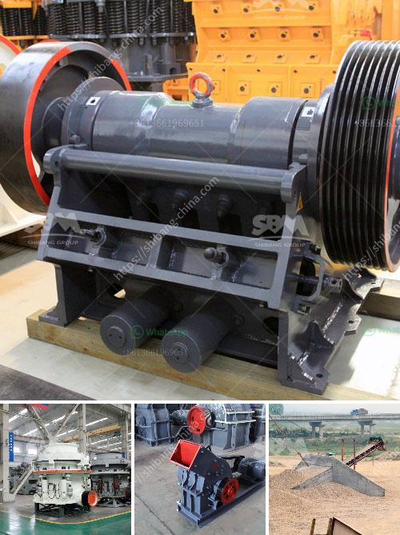

<h3>price of stone crusher in nigerian curency</h3>
The price of stone crusher in Nigerian currency reflects the fact that this costly machine requires immense investment for its procurement. Nigeria is endowed with vast reserves of stones needed for different construction purposes. Stone crusher is an important equipment in the mining and construction industry, and it plays a significant role in the development of Nigerian infrastructure.

Different types of stone crushers have varying prices. In Nigeria, there are many stone crusher suppliers and contractors available. Due to the high competition, these suppliers and contractors offer different price options. In order to ensure that buyers are getting value for their money, it is advisable to compare prices from different suppliers before making a purchase.

The price of a stone crusher in Nigeria is not constant due to factors such as location, supplier, and market volatility. However, there are key considerations to be taken into account before purchasing a stone crusher including brand and model, efficiency, and safety measures. Some key brands for stone crushers in Nigeria are ZENITH, HONGXING, SHANBAG, and METSO.

A stone crusher is either manually operated or fuel or electrically operated. Whichever the case, it relies on intensive mechanical means to break stones, which are collected in a stone crushing machine. In order to have a smooth operation and extend the machine's lifespan, maintenance is a key consideration.

Nigeria is a populous country with fast-paced development; therefore, construction activities are ongoing, which requires the use of stone crushers. This makes it a profitable business opportunity for individuals or companies who want to establish a stone crushing plant. The cost of machinery needed in a stone crushing plant is based on relevant market research.

One of the most expensive machinery in a stone crushing plant is a stone crusher. A stone crusher typically utilizes two or three stages of crushing process to reduce stone sizes. Before the stone is crushed, it's screened for proper sizes. For instance, if a stone is too big, it cannot be used in construction. Therefore, stone crushers are designed to handle different sizes of stones.

In conclusion, the price of stone crusher in Nigerian currency depends on the brand and model of the machine. Efficiency, safety measures, and easy maintenance are other factors that influence the price. It is crucial for buyers to evaluate different suppliers and contractors to get the best value for their investment. Stone crushers are important equipment in Nigeria's mining and construction industry and play a significant role in the country's infrastructure development.
<h3>Contact us</h3><ul><li><strong>Whatsapp:&nbsp;<a href="https://wa.me/8613661969651">+8613661969651</a></strong></li><li><a href="https://swt.shibang-china.com/?git&amp;zhl&amp;price of stone crusher in nigerian curency"><strong>Online Service(chat now)</strong></a></li></ul><h3>Related</h3><ul><li><a href='grinding machines for clay.md'>grinding machines for clay</a></li><li><a href='small scale marble crushing and processing industery.md'>small scale marble crushing and processing industery</a></li><li><a href='central crushing granite.md'>central crushing granite</a></li><li><a href='tata voltas stone crusher.md'>tata voltas stone crusher</a></li><li><a href='mobile screening plant south africa.md'>mobile screening plant south africa</a></li></ul>