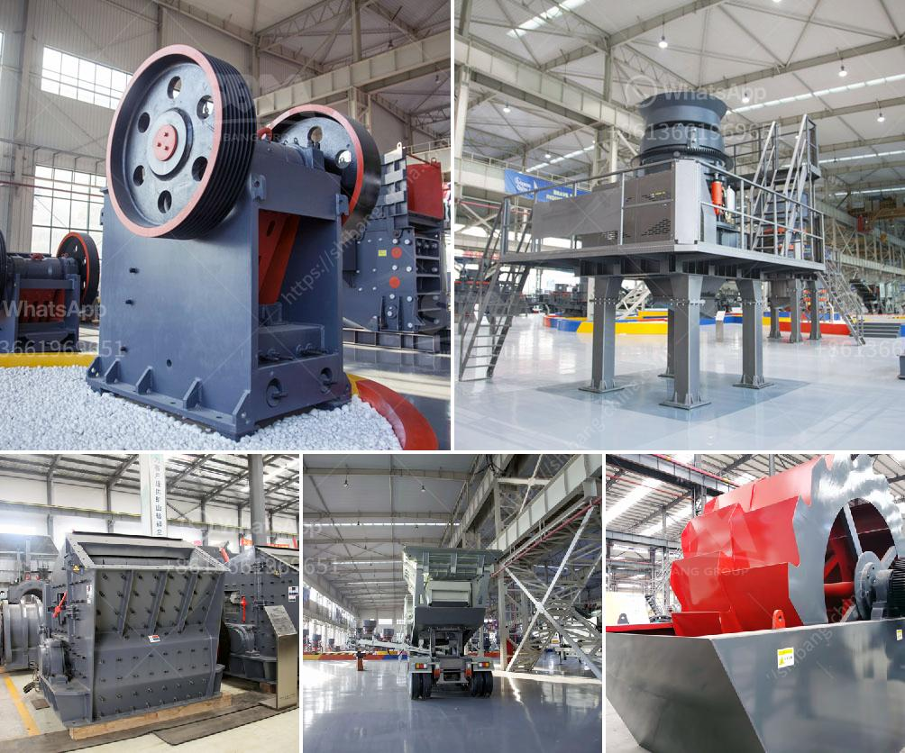

<h3>price quotation for rotary kiln machine</h3>
When it comes to purchasing industrial machinery, obtaining a price quotation is essential. This article aims to provide a brief overview of the factors influencing the cost of a rotary kiln machine. 

First and foremost, it is important to understand what a rotary kiln machine is and its various applications. A rotary kiln is a cylindrical vessel used for high-temperature processing of materials, typically in the form of powders or granules. It is widely used in industries such as cement production, mineral processing, and chemical manufacturing. The primary purpose of a rotary kiln is to carry out a thermal treatment process, such as calcination, sintering, or drying.

When requesting a price quotation for a rotary kiln machine, several factors are taken into account. The size and capacity of the kiln play a crucial role in determining its price. Larger kilns with higher production capacities tend to be more expensive due to the increased material and manufacturing costs involved.

The material of construction is another critical factor influencing the price quotation. Rotary kilns can be made from different materials, such as cast iron, steel, or refractory bricks. Each material has its own advantages and price range, with refractory bricks being the most expensive option due to their high-temperature resistance and durability.

Additionally, the type of fuel used for the kiln operation affects its price. Rotary kilns can be powered by various fuel sources, including natural gas, coal, or electricity. The availability and cost of the selected fuel type can impact the overall expenditure on operating the kiln.

Furthermore, any additional features or customization requirements will also contribute to the final price. Some examples of optional features for rotary kilns include automated control systems, insulation jackets, and advanced combustion systems. These features enhance the performance and efficiency of the equipment and are included in the price quotation accordingly.

It is important to note that the price quotation for a rotary kiln machine is not the only consideration when making a purchase decision. Factors such as the reputation and experience of the manufacturer, the availability of spare parts, after-sales support, and warranty terms should also be taken into account.

In conclusion, obtaining a price quotation for a rotary kiln machine involves considering factors such as size, capacity, construction material, fuel type, additional features, and manufacturer reputation. By understanding these parameters, buyers can make informed decisions while investing in this crucial industrial equipment.
<h3>Contact us</h3><ul><li><strong>Whatsapp:&nbsp;<a href="https://wa.me/8613661969651">+8613661969651</a></strong></li><li><a href="https://swt.shibang-china.com/?git&amp;zhl&amp;price quotation for rotary kiln machine"><strong>Online Service(chat now)</strong></a></li></ul><h3>Related</h3><ul><li><a href='ton per hour coal crushing plant.md'>ton per hour coal crushing plant</a></li><li><a href='second hand equipment for sale in south africa.md'>second hand equipment for sale in south africa</a></li><li><a href='mobile crushers for hire in product.md'>mobile crushers for hire in product</a></li><li><a href='used in cement plant.md'>used in cement plant</a></li><li><a href='quartz rock processing equipment.md'>quartz rock processing equipment</a></li></ul>