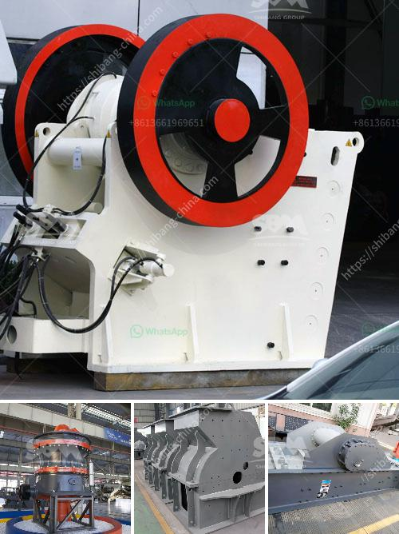

<h3>prices of iron ore crushers</h3>
The global iron ore market is experiencing a steady increase in prices, largely driven by the surging demand for the steel-making ingredient. As a result, the prices of iron ore crushers are also increasing. This is particularly noticeable in the higher range of crushers, with prices starting from $100,000 and going up to $1 million or more.

Iron ore crushers are essential equipment in mining operations that reduce the size of raw ore into manageable sizes for transportation and further processing. The prices of these crushers depend on several factors such as the type, size, capacity, and technical specifications. Additionally, the cost of operation, maintenance, and the availability of spare parts also influence the overall price.

In recent years, there has been a rapid growth in the demand for iron ore, particularly from emerging economies like China and India. This surge in demand is mainly driven by the construction and infrastructure sectors, which require large amounts of steel. As a result, steel mills require a consistent supply of iron ore, leading to increased demand for crushers.

Moreover, advancements in technology have also contributed to the rise in prices of iron ore crushers. Manufacturers have been developing more efficient and technologically advanced crushers that improve productivity and reduce energy consumption. These technologically superior crushers often come at a higher price.

Additionally, the price of iron ore itself plays a crucial role in determining the prices of crushers. If the price of iron ore is high, mining companies are willing to invest more in equipment like crushers to extract and process more ore. Conversely, if the price of iron ore is low, there might be a sluggish demand for crushers, leading to a decrease in prices.

In conclusion, the prices of iron ore crushers are on the rise due to the increasing demand for iron ore and advancements in technology. To meet the growing demand, mining companies are investing in high-capacity crushers that offer enhanced efficiency and productivity. However, the fluctuating price of iron ore and the availability of spare parts also influence the overall price of these crushers.
<h3>Contact us</h3><ul><li><strong>Whatsapp:&nbsp;<a href="https://wa.me/8613661969651">+8613661969651</a></strong></li><li><a href="https://swt.shibang-china.com/?git&amp;zhl&amp;prices of iron ore crushers"><strong>Online Service(chat now)</strong></a></li></ul><h3>Related</h3><ul><li><a href='feasibility study for stone crusher plants.md'>feasibility study for stone crusher plants</a></li><li><a href='price of roller crushers in usa.md'>price of roller crushers in usa</a></li><li><a href='crusher plant for coal for sale in south africa.md'>crusher plant for coal for sale in south africa</a></li><li><a href='accessories for chia conveyor belts.md'>accessories for chia conveyor belts</a></li><li><a href='mica processing plant in jharkhand.md'>mica processing plant in jharkhand</a></li></ul>