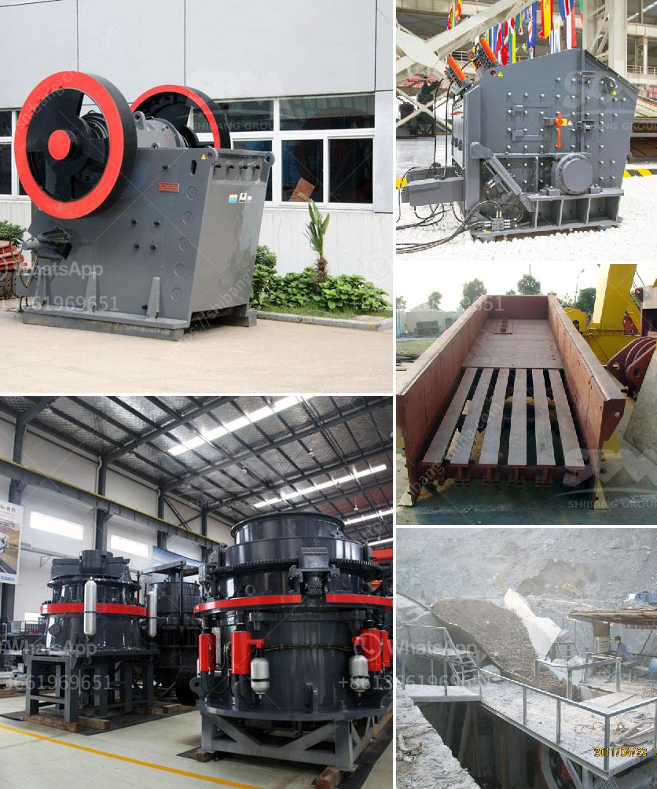

<h3>prices of sand making machine</h3>
As the demand for construction materials continues to rise, the need for efficient and reliable sand making machines has become more important than ever before. These machines are essential for producing high-quality sand, which is a key component in the construction industry. However, one important factor that must be considered is the price of these machines.

The prices of sand making machines can vary greatly depending on the features, capabilities, and manufacturers. Generally, the cost of a sand making machine ranges from $5,000 to $30,000. This price range is highly determined by the production capacity, power consumption, and overall quality of the machine.

For small-scale or entry-level sand making machines, the price tends to be more affordable, ranging from $5,000 to $15,000. These machines usually have a lower production capacity, suitable for small projects or individuals starting in the construction industry. Despite their compact size and lower price, they can still provide excellent sand production results.

On the other hand, high-end sand making machines with advanced features and large production capacities can cost between $15,000 and $30,000. These machines are ideal for large-scale construction projects that require a high volume of sand production. With their advanced technology and increased production capabilities, these machines offer significant efficiency and productivity advantages.

While the initial price may seem significant, it is important to consider the long-term benefits and return on investment. High-quality sand production plays a crucial role in the construction industry. By investing in a reliable and efficient sand making machine, construction companies can ensure the availability of high-quality sand, minimize production costs, and improve overall project quality.

Furthermore, the cost of sand is constantly increasing due to factors like transportation, environmental regulations, and availability. Having an in-house sand making machine allows businesses to have better control over the sand production process and reduce dependency on external suppliers. This, in turn, can lead to significant cost savings in the long run.

In conclusion, the prices of sand making machines are a worthwhile investment for construction companies and individuals in the industry. While the initial cost may vary depending on factors like production capacity and quality, the long-term benefits make it a sustainable choice. With reliable and efficient sand making machines, businesses can ensure consistent and high-quality sand production, leading to improved project outcomes and cost savings.
<h3>Contact us</h3><ul><li><strong>Whatsapp:&nbsp;<a href="https://wa.me/8613661969651">+8613661969651</a></strong></li><li><a href="https://swt.shibang-china.com/?git&amp;zhl&amp;prices of sand making machine"><strong>Online Service(chat now)</strong></a></li></ul><h3>Related</h3><ul><li><a href='diesel stone crushers from germany.md'>diesel stone crushers from germany</a></li><li><a href='stone crushers in cali.md'>stone crushers in cali</a></li><li><a href='harga stone crusher 250 ton.md'>harga stone crusher 250 ton</a></li><li><a href='equipment needed for quarry crusher.md'>equipment needed for quarry crusher</a></li><li><a href='buy and sell conveyor belts in south africa.md'>buy and sell conveyor belts in south africa</a></li></ul>