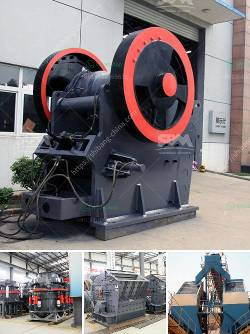

<h3>prices of sodium carbonate crushers</h3>
The market for sodium carbonate crushers is expected to grow steadily in the coming years. Sodium carbonate, also known as soda ash or washing soda, is a white, odorless powder used in many industries such as glass manufacturing, detergents, and water treatment. As the demand for sodium carbonate continues to rise, the need for crushers to process the raw materials is also increasing.

The price of sodium carbonate crushers ranges from hundreds to thousands of dollars. How much you'll spend depends on the quality, efficiency, and capacity of the machine. Affordable options can be found for as low as $500, while more high-end models can go up to $20,000 or beyond.

One key factor that affects the price of sodium carbonate crushers is the type of machine. There are several types of crushers available in the market, including jaw crushers, cone crushers, and impact crushers. Each type has its own advantages and disadvantages, and the prices vary accordingly. Jaw crushers, which are commonly used in the mining industry, are often more expensive due to their larger size and higher capacity. On the other hand, cone crushers are more affordable and preferred by industries with smaller production needs.

Another aspect that affects the price is the capacity of the crusher. The capacity, measured in tons per hour (TPH), indicates how much material the machine can process within a specified time frame. Crushers with higher capacities tend to be more expensive. For instance, a crusher with a capacity of 200 TPH will cost more compared to a crusher with a capacity of 100 TPH.

The quality of the crusher is another crucial factor that determines its price. Higher-quality crushers are usually made from durable materials and boast advanced features that improve efficiency and reduce maintenance costs. These premium crushers generally come with a higher price tag, but they offer better performance, longer lifespan, and increased profitability for businesses.

Additionally, market demand and competition can also influence the price of sodium carbonate crushers. In regions with a high demand for sodium carbonate, crushers may be priced higher due to increased competition and limited supply. On the other hand, in areas where the demand is relatively low, prices may be more competitive to attract potential buyers.

When considering the price of sodium carbonate crushers, it's important to take into account both the upfront cost and the long-term benefits. A higher-priced crusher might offer better efficiency, lower maintenance costs, and higher production rates, ultimately resulting in higher profitability for your business. Conversely, a cheaper crusher might save you money initially, but might have lower productivity and require more frequent repairs, leading to higher operational costs in the long run.

In conclusion, the prices of sodium carbonate crushers vary depending on the type, capacity, and quality of the machine. It's essential for businesses to carefully evaluate their needs, budget, and long-term goals when choosing a crusher. Investing in a high-quality, efficient crusher might entail a higher upfront cost, but it can yield significant benefits in terms of increased productivity, reduced maintenance, and improved profitability in the long term.
<h3>Contact us</h3><ul><li><strong>Whatsapp:&nbsp;<a href="https://wa.me/8613661969651">+8613661969651</a></strong></li><li><a href="https://swt.shibang-china.com/?git&amp;zhl&amp;prices of sodium carbonate crushers"><strong>Online Service(chat now)</strong></a></li></ul><h3>Related</h3><ul><li><a href='roller mill for powders.md'>roller mill for powders</a></li><li><a href='jaw crusher adalah.md'>jaw crusher adalah</a></li><li><a href='marble quarry crusher equipments.md'>marble quarry crusher equipments</a></li><li><a href='gravel crushing machine.md'>gravel crushing machine</a></li><li><a href='dolomite production process.md'>dolomite production process</a></li></ul>