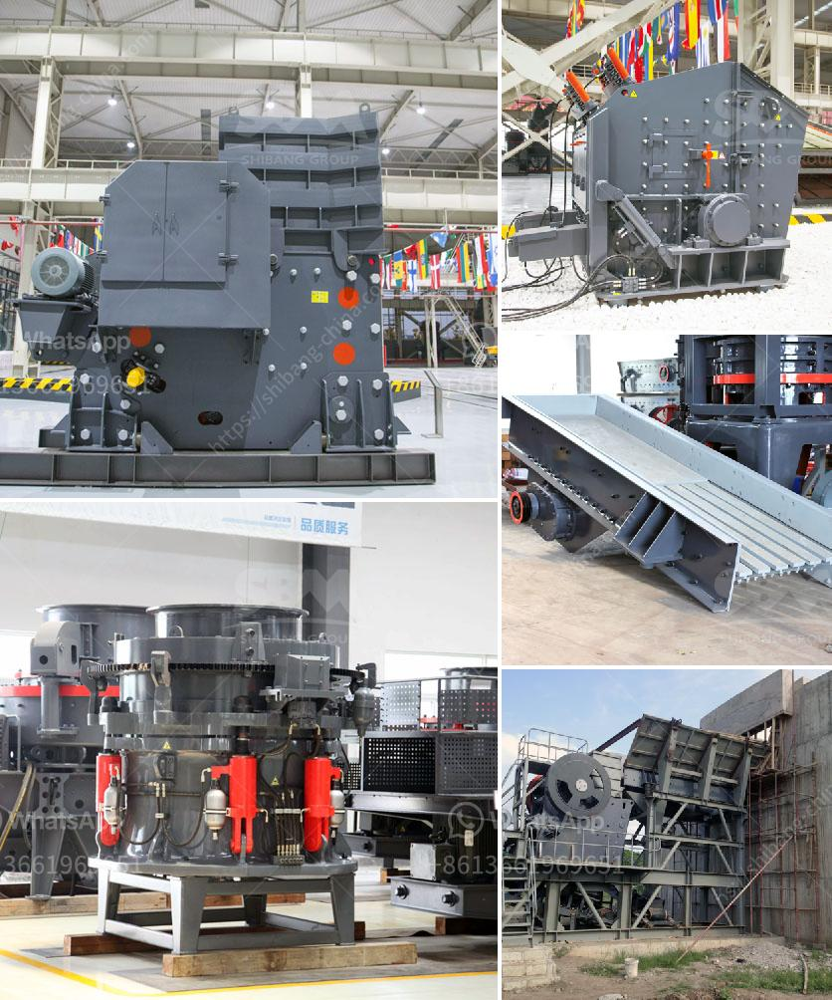

<h3>prices of vibrating screens</h3>
The prices of vibrating screens vary depending on various factors. These factors include the size of the screen, the materials used in its construction, the brand, and the additional features and functionalities it offers. In this article, we will discuss some of these factors and their influence on the price of vibrating screens.

Size is one of the first factors that affect the price of a vibrating screen. Generally, larger screens have higher prices as they require more materials during manufacturing. Additionally, larger screens offer larger screening areas, which means they can handle more volume of materials at a time. This makes them more suitable for applications that require high production capacity. However, if you have a smaller operation or limited space, a smaller screen might be more cost-effective.

The materials used in the construction of a vibrating screen are crucial for its durability and performance. High-quality materials, such as stainless steel or high-quality alloys, are more expensive than lower-grade materials. These premium materials are important for withstanding the demanding conditions often found in industrial applications. They provide resistance to corrosion, abrasion, and wear, ensuring that the screen can operate efficiently for extended periods without requiring frequent replacements or maintenance.

The brand of the vibrating screen can also have an impact on its price. Well-established and reputable brands tend to have higher prices compared to lesser-known brands. The higher price can often be justified because established brands have a proven track record of manufacturing reliable and high-performing screens. They also provide better customer service and after-sales support, which is a crucial factor for many buyers.

Additional features and functionalities can also increase the cost of a vibrating screen. For example, screens with adjustable frequency or amplitude settings may come at a higher price point. These features allow users to customize the screen's performance according to their specific needs. Other add-ons, such as dust covers, noise reduction measures, or integrated cleaning systems, can also contribute to the overall price of the screen.

To give a general idea, basic vibrating screens with standard sizes and minimal additional features can range anywhere from a few hundred to several thousand dollars. However, larger screens with premium materials and advanced functionalities can cost tens of thousands of dollars.

In conclusion, the price of a vibrating screen depends on several factors, including size, materials, brand, and additional features. It is essential for buyers to assess their specific requirements and evaluate the options available in the market to find the most suitable vibrating screen for their needs and budget. Investing in a high-quality vibrating screen is crucial for achieving efficient and effective material processing and screening operations.
<h3>Contact us</h3><ul><li><strong>Whatsapp:&nbsp;<a href="https://wa.me/8613661969651">+8613661969651</a></strong></li><li><a href="https://swt.shibang-china.com/?git&amp;zhl&amp;prices of vibrating screens"><strong>Online Service(chat now)</strong></a></li></ul><h3>Related</h3><ul><li><a href='grinding zeolite ball mill machine.md'>grinding zeolite ball mill machine</a></li><li><a href='conveyor belt manufacturers in bangladesh.md'>conveyor belt manufacturers in bangladesh</a></li><li><a href='quarry machines repairing centre in chennai.md'>quarry machines repairing centre in chennai</a></li><li><a href='limestone crushing plant manufacturer.md'>limestone crushing plant manufacturer</a></li><li><a href='crushing machine price in malaysia.md'>crushing machine price in malaysia</a></li></ul>