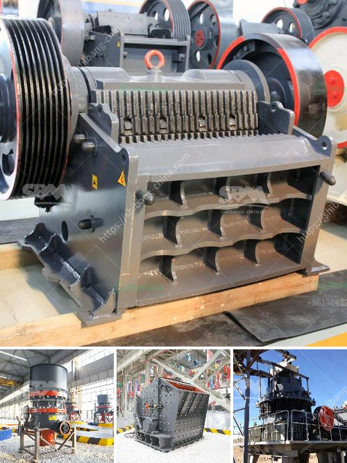

<h3>prices stone crusher machine</h3>
Stone crusher machine is a device used to crush rocks into smaller pieces, usually for gravel or some other road or building application. Most stone-crushing machines are heavy and powerful, and can process large quantities of stone in a relatively short amount of time.

Stone crusher machines provide numerous options for various applications, making it a versatile machine that can deliver high-quality materials. For instance, crushed stone is used for base material in road construction, and sand is used for concrete and asphalt production.

The price of a stone crusher machine varies widely based on certain factors. These include the machine's capacity, the type of stone it can crush, the output size of the crushed stone, and the availability of spare parts. These factors affect the price of the machine, and ultimately, its overall value to the buyer.

Capacity is an important factor to consider when purchasing a stone crusher machine. Different machines have different capacities. Some machines can produce up to 600 tons of stone per hour, while others can only produce a few hundred tons. Machines with higher capacities are generally more expensive and are suitable for larger-scale operations.

The type of stone a machine can crush is another important consideration. Not all stone crushers can crush every type of stone. Some crushers can only handle soft or medium-hard stones, while others can handle very hard stones. Crushing machines that can handle a wider range of stone types are generally more expensive.

The output size of crushed stone is another factor to consider. Portable rock crushers generally produce smaller pieces of crushed stone than stationary crushers. This makes portable crushers ideal for applications where the desired stone size is relatively small, such as landscaping or residential construction.

Lastly, the availability of spare parts can impact the price of a stone crusher machine. If spare parts are readily available, the machine can be repaired quickly and easily, reducing downtime and improving productivity. On the other hand, if spare parts are hard to come by, repairs may take longer and be more expensive.

In conclusion, the price of a stone crusher machine is influenced by various factors, including capacity, type, output size, and availability of spare parts. Stone crusher machines with higher capacity and better output quality are generally more expensive. However, they also tend to produce more high-quality, consistent stone products. When purchasing a stone crusher machine, it is important to consider both the price and the value that the machine will bring to your operation.
<h3>Contact us</h3><ul><li><strong>Whatsapp:&nbsp;<a href="https://wa.me/8613661969651">+8613661969651</a></strong></li><li><a href="https://swt.shibang-china.com/?git&amp;zhl&amp;prices stone crusher machine"><strong>Online Service(chat now)</strong></a></li></ul><h3>Related</h3><ul><li><a href='jaw crushers manufacturers.md'>jaw crushers manufacturers</a></li><li><a href='mobile crusher plant for hire in mpumalanga province.md'>mobile crusher plant for hire in mpumalanga province</a></li><li><a href='alluvial gold washing plants.md'>alluvial gold washing plants</a></li><li><a href='company in japan dealing in portable crusher machine.md'>company in japan dealing in portable crusher machine</a></li><li><a href='how much does a quarry machine cost.md'>how much does a quarry machine cost</a></li></ul>