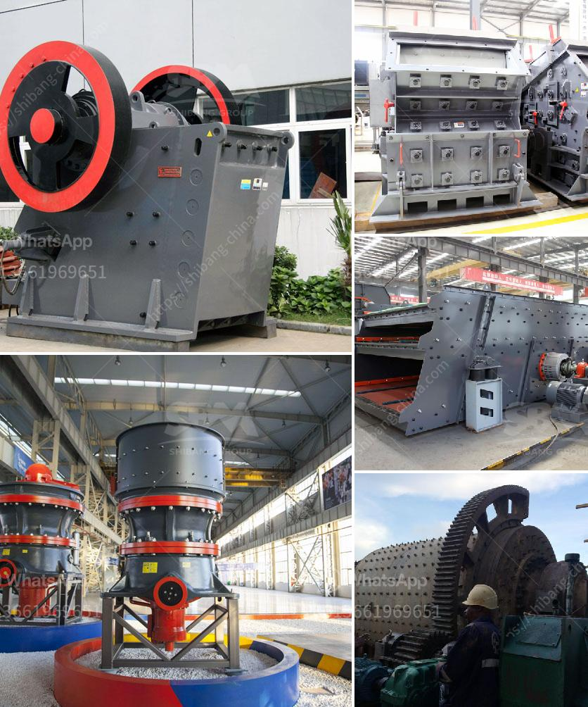

<h3>primary cone crusher</h3>
The primary cone crusher is a type of crusher that is used in the first stage of mineral processing. It has been designed to handle large feed sizes and can crush even the toughest and most abrasive materials. Unlike other crushers, the cone crusher has a mantle that rotates around its own axis, enabling it to exert crushing forces on the material being processed.

One of the main advantages of the primary cone crusher is its ability to process rocks with high hardness levels. This makes it ideal for applications where there is a need for high-quality materials, such as in the construction, mining, and quarrying industries. The cone crusher can easily handle rocks with a Mohs hardness of up to 7, reducing the need for secondary crushing equipment.

Another advantage of the primary cone crusher is its versatility. It can be used in both primary and secondary crushing operations, depending on the application. For example, it can be used for primary crushing of rocks and minerals, or as a secondary crusher for reducing the size of processed materials.

The primary cone crusher is also known for being easy to maintain and operate. It offers reliability and high performance, making it a cost-effective choice for crushing applications. The cone crusher provides excellent reduction and product cubicity for the production of high-quality aggregate and sub-base materials.

Moreover, the cone crusher enables the production of specific sizes of products with high precision. It has a closed side setting (CSS) system that allows for accurate control of the product size. This ensures consistent product shape and quality, meeting the requirements of various specifications.

In conclusion, the primary cone crusher is a powerful and versatile piece of equipment that offers high capacity and reduced operating costs. It is ideal for demanding crushing applications in mines, quarries, and construction sites. With its excellent reliability, ease of maintenance, and precise product control, the primary cone crusher continues to be a reliable choice for efficient rock crushing.
<h3>Contact us</h3><ul><li><strong>Whatsapp:&nbsp;<a href="https://wa.me/8613661969651">+8613661969651</a></strong></li><li><a href="https://swt.shibang-china.com/?git&amp;zhl&amp;primary cone crusher"><strong>Online Service(chat now)</strong></a></li></ul><h3>Related</h3><ul><li><a href='rubble recycle concrete crusher hire.md'>rubble recycle concrete crusher hire</a></li><li><a href='kaolin clay processing flow chart.md'>kaolin clay processing flow chart</a></li><li><a href='gold wash plant trummel revelstoke.md'>gold wash plant trummel revelstoke</a></li><li><a href='cobalt concentrate processing equiopment manufacturers.md'>cobalt concentrate processing equiopment manufacturers</a></li><li><a href='small feldspar grinding milling plant in nigeria.md'>small feldspar grinding milling plant in nigeria</a></li></ul>