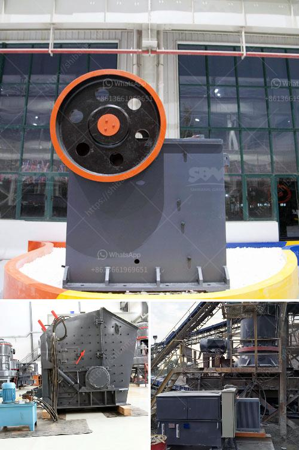

<h3>primary crusher ball milling pengertian</h3>
Primary crushers are machines used in the first stage of crushing rocks in mining operations. They play a crucial role in reducing the size of the rocks to enable further processing. One commonly used primary crusher is the jaw crusher, which is designed to crush large rocks into smaller ones. It utilizes a compressive force to break down the rocks.

After the rocks are crushed by the primary crusher, they are further processed using ball milling. Ball milling is a method of grinding materials into fine particles using steel or ceramic balls as the grinding medium. This process is commonly used in various industries such as mining, metallurgy, and construction.

The main purpose of ball milling is to reduce the size of the particles and enhance their reactivity. It involves placing the materials in a rotating cylinder, which is partially filled with balls. The rotation of the cylinder causes the balls to cascade and grind the materials. As the particles collide with the balls, they are broken down into smaller sizes.

Ball milling offers several advantages over other grinding methods. It is a cost-effective process, as it requires minimal energy consumption. It also provides a uniform particle size distribution, ensuring consistent quality of the final product. Additionally, ball milling can be performed in a dry or wet environment, making it versatile for various applications.

In conclusion, primary crushers and ball milling are vital processes in the mining industry. The primary crusher plays a key role in reducing the size of the rocks, while ball milling is a grinding method used to refine particles. These processes work together to enable efficient and effective mining operations.
<h3>Contact us</h3><ul><li><strong>Whatsapp:&nbsp;<a href="https://wa.me/8613661969651">+8613661969651</a></strong></li><li><a href="https://swt.shibang-china.com/?git&amp;zhl&amp;primary crusher ball milling pengertian"><strong>Online Service(chat now)</strong></a></li></ul><h3>Related</h3><ul><li><a href='hammer mills for granite.md'>hammer mills for granite</a></li><li><a href='manufacturer crusher machines contacts.md'>manufacturer crusher machines contacts</a></li><li><a href='calcium carbonate machinery.md'>calcium carbonate machinery</a></li><li><a href='how pyrite mined and processed.md'>how pyrite mined and processed</a></li><li><a href='limestone crushing power consumption.md'>limestone crushing power consumption</a></li></ul>