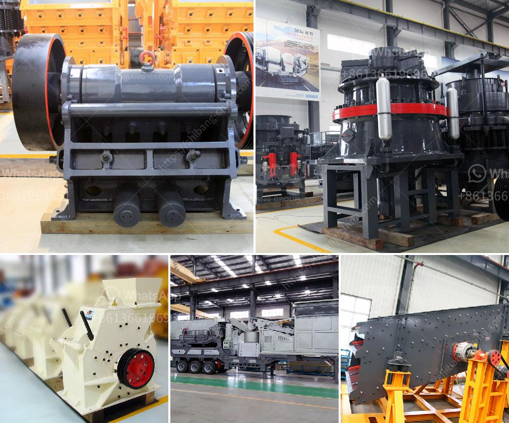

<h3>primary jaw crusher saudi</h3>
The primary jaw crusher is a vital piece of machinery. Often the success (or failure) of a crushing plant depends upon its performance. The primary crusher receives large lumps of rock directly from mines, and reduces it to sizes suitable for downstream operations.

The Rhino Series Primary Jaw Crusher offers Huge Advancements over traditional Single Toggle Machines. It requires minimum maintenance and is Perfect for “Jaw-Jaw combination” crushing. This machine incorporates modern technologies to give unbeatable economy and a long service life.

The use of primary jaw crushers and secondary cones help ensure that spec. Also, primary screeners and product screening plants will be used. The heavy-duty crusher can reduce large lumps of rock into smaller sizes. It is often used as a primary crusher in a multistage crushing process or as a stand-alone unit.

Primary screening through slotted grate in the feeder trough. Classical plant for stone crushing which is, however, also well suited for concrete recycling.

The standard vibrating discharge chute below the crusher reduces wear and tear on the belt of the main discharge conveyor, thus considerably increasing the plant's operational safety.

The flanking belt conveyors are also protected against wear. The fully hydraulic gap adjustment of the crusher chamber ensures a highly efficient production process.

The development of construction infrastructure in Saudi Arabia is causing havoc on natural resources and their replenishment rates. Crusher plant in Saudi Arabia and Crusher plant in Saudi Arabia service promise: from the design, we do every step carefully to satisfy clients to the best .

CPC is an engineering company specializing in the development and manufacturing of high-quality machines. Our equipment is built to last a lifetime and designed to produce premium end products.

CPC Equipments Private Limited is certified with ISO 9001:2015, which ensures that the products offered by us are reliable and made with premium materials.

Furthermore, we design and install our primary jaw crushers, keeping in mind the specifications and requirements of our clients and offer them at a competitive price. We are a customer-centric company and believe in delivering superior quality products and services to our clients.

In conclusion, the primary jaw crusher is a vital piece of machinery that receives large lumps of rock directly from mines and reduces it to smaller sizes, suitable for downstream operations. CPC 3624 Rhino Primary Jaw Crusher – Upto 150 TPH Capacity. The Rhino Series Primary Jaw Crusher offers Huge Advancements over traditional Single Toggle Machines. It requires minimum maintenance and is Perfect for “Jaw-Jaw combination” crushing. This machine incorporates modern technologies to give unbeatable economy and a long service life.
<h3>Contact us</h3><ul><li><strong>Whatsapp:&nbsp;<a href="https://wa.me/8613661969651">+8613661969651</a></strong></li><li><a href="https://swt.shibang-china.com/?git&amp;zhl&amp;primary jaw crusher saudi"><strong>Online Service(chat now)</strong></a></li></ul><h3>Related</h3><ul><li><a href='cost of ball mill in india.md'>cost of ball mill in india</a></li><li><a href='rock crusher distributors in phillipinwes.md'>rock crusher distributors in phillipinwes</a></li><li><a href='ultra white silica processing.md'>ultra white silica processing</a></li><li><a href='crusher peru price crushing plant.md'>crusher peru price crushing plant</a></li><li><a href='gypsum production machinery.md'>gypsum production machinery</a></li></ul>