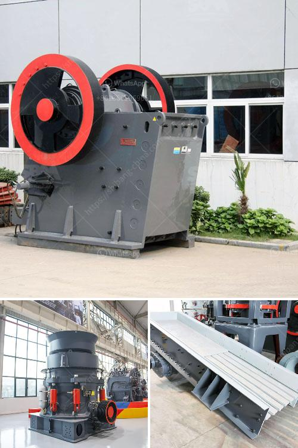

<h3>process of coal crushing plant</h3>
Coal, a fossil fuel, is a combustible black or brownish-black sedimentary rock primarily composed of carbon along with various other elements such as hydrogen, sulfur, oxygen, and nitrogen. It is extracted from the ground by mining either underground or in open pits. The main objective of coal mining is to obtain coal for industrial use and power generation.

Once the coal is mined, it goes through a series of processes in a coal crushing plant to remove impurities and create uniform size for efficient utilization. The crushing process involves reducing the coal size to a manageable level and separating impurities to obtain pure coal. This process consists of various stages, including crushing, screening, coal washing, and dewatering.

Firstly, large coal chunks are crushed by a primary crusher, typically jaw crusher, to a smaller size suitable for transport to a secondary crushing plant. In most cases, secondary crushers are cone crushers or impact crushers that provide further reduction in size. The crushed coal is then screened to separate rock and other impurities before being sent to a washing plant.

In the coal washing plant, the coal undergoes various processes to remove impurities such as sulfur, ash, and rock. The coal is crushed and fed into a dense medium cyclone (DMC) where most of the impurities are removed, leaving behind a purer form of coal. The DMC uses a mixture of water and a dense medium, typically magnetite or ferrosilicon, to separate coal and impurities based on their density differences.

After washing, the coal is dewatered to reduce moisture content and improve its handling and combustion properties. This is done using various methods such as vacuum filters, centrifuges, or thermal drying processes. The dewatered coal is then transported to storage or directly loaded onto transport vehicles for delivery.

In conclusion, the process of crushing coal in a coal crushing plant involves several stages to remove impurities and create a uniform size suitable for utilization. This ensures the efficient use of coal for various industrial applications such as power generation, steel production, and cement manufacturing. The coal crushing plant plays a crucial role in the mining industry as it is responsible for providing the necessary coal fuel for power generation and industrial processes.
<h3>Contact us</h3><ul><li><strong>Whatsapp:&nbsp;<a href="https://wa.me/8613661969651">+8613661969651</a></strong></li><li><a href="https://swt.shibang-china.com/?git&amp;zhl&amp;process of coal crushing plant"><strong>Online Service(chat now)</strong></a></li></ul><h3>Related</h3><ul><li><a href='grinding roller mill machine.md'>grinding roller mill machine</a></li><li><a href='grinding media balls suppliers in south africa.md'>grinding media balls suppliers in south africa</a></li><li><a href='how to draw a stone crusher.md'>how to draw a stone crusher</a></li><li><a href='impact crusher 70 130tph.md'>impact crusher 70 130tph</a></li><li><a href='aggregate production line.md'>aggregate production line</a></li></ul>