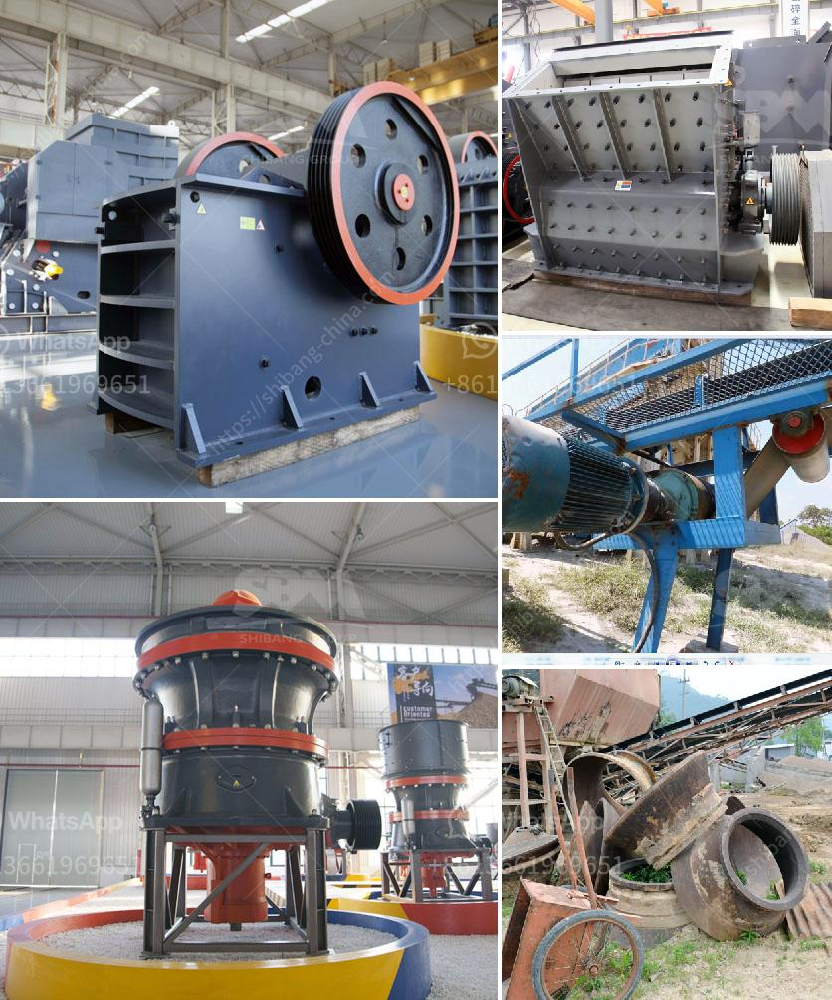

<h3>process of kaolin mining crusher</h3>
Kaolin, also known as china clay, is a white, soft, plastic clay mainly composed of the mineral kaolinite. It is commonly used in the production of ceramics, paper, paint, plastics, rubber, and many other products. Kaolin deposits can be found in various parts of the world, but the largest and most commercially exploitable deposits are located in the United States, Brazil, United Kingdom, China, and Ukraine.

The process of kaolin mining crusher involves several steps. First, the kaolin ore needs to be crushed to smaller sizes suitable for further processing. This is achieved by using a crusher, which breaks the ore into smaller pieces. The crushed ore is then transported to a vibrating screen for sorting. The oversize pieces are further crushed and the undersize material passes through the screen for further processing.

Once the kaolin ore has been crushed and sorted, it is ready for further refinement. The next step in the process is beneficiation, which involves separating the impurities from the kaolin clay to improve its quality and purity. This is typically done through a series of processes, including wet screening, hydrocycloning, magnetic separation, and froth flotation.

In wet screening, water is added to the crushed and sorted kaolin clay to form a slurry. The slurry is then passed through a series of screens, which separate the larger particles from the smaller ones. The larger particles, containing impurities, are discarded, while the smaller particles are used in the next step of the process.

Hydrocycloning is a process that uses centrifugal force to separate the fine particles of kaolin clay from the larger particles. The slurry is fed into a hydrocyclone, where the centrifugal force causes the larger particles to be forced to the outer wall of the cyclone and collected as an overflow. The fine particles, which are the desired kaolin clay, are collected as an underflow and further processed.

Magnetic separation is another important step in kaolin beneficiation. In this process, high-intensity magnetic separators are used to remove magnetic impurities from the kaolin clay. The clay is passed through a magnetic field, which attracts and removes the magnetic impurities, leaving behind the pure kaolin clay.

Froth flotation is the final step in the beneficiation process. In this process, the kaolin clay is mixed with water and a collector, such as a fatty acid or a hydroxamate, to form a slurry. Air bubbles are then introduced into the slurry, which attach to the kaolin clay particles and float them to the surface. The froth, containing the kaolin clay, is collected and dried to produce the final product.

Once the kaolin clay has been processed, it may undergo further treatment, such as drying, calcination, or chemical bleaching, depending on its intended use. Drying involves removing excess moisture from the clay to improve its handling and storage properties. Calcination is a process that involves heating the clay to high temperatures to improve its brightness, color, and other qualities. Chemical bleaching is used to further refine the clay and remove any remaining impurities.

In conclusion, the process of kaolin mining crusher involves several steps, including crushing, screening, beneficiation, and further treatment. Each step is important in producing kaolin clay with the desired quality and purity for various industrial applications.
<h3>Contact us</h3><ul><li><strong>Whatsapp:&nbsp;<a href="https://wa.me/8613661969651">+8613661969651</a></strong></li><li><a href="https://swt.shibang-china.com/?git&amp;zhl&amp;process of kaolin mining crusher"><strong>Online Service(chat now)</strong></a></li></ul><h3>Related</h3><ul><li><a href='how to draw a stone crusher.md'>how to draw a stone crusher</a></li><li><a href='ton per hour coal crushing plant.md'>ton per hour coal crushing plant</a></li><li><a href='pulverizer machines manufacturers.md'>pulverizer machines manufacturers</a></li><li><a href='yd mobile crushing plant.md'>yd mobile crushing plant</a></li><li><a href='cement manufacturing process pdf.md'>cement manufacturing process pdf</a></li></ul>