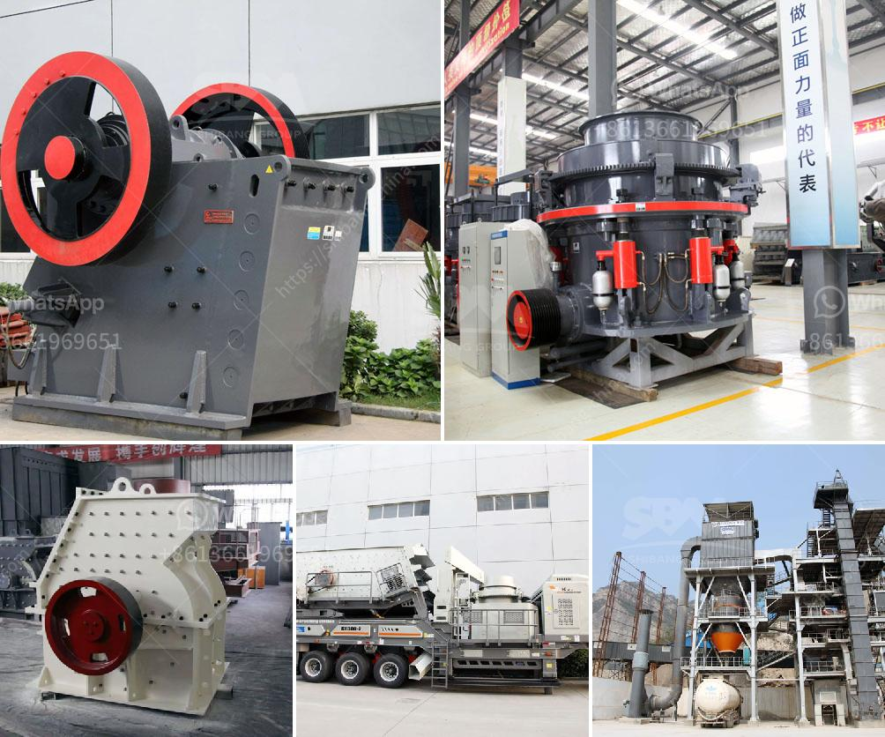

<h3>processing of kaolin crusher</h3>
Kaolin, also known as china clay, is a white, soft, and plastic clay mineral that is commonly used in many industrial applications. It is a sedimentary rock, rich in kaolinite, which is a clay mineral containing various amounts of other minerals such as muscovite, quartz, feldspar, and anatase. The processing of kaolin involves the use of various types of crushers that can crush it into different sizes.

The first step in the processing of kaolin is the primary crushing of the raw material. The kaolin lumps are crushed by the crusher to the size of about 25mm. In order to be processed further, the material needs to be transported to the next stage, which is the secondary crushing.

In the secondary crushing stage, the kaolin is reduced to smaller sizes, ranging from 25mm to 10mm. The crusher used in this stage is called a secondary crusher. There are different types of secondary crushers available, such as impact crushers, cone crushers, and roll crushers. These crushers are capable of producing a finer product compared to the primary crusher.

After the secondary crushing, the kaolin is further processed using various types of grinding machines. The most common type of grinding machine is the ball mill. In the kaolin grinding process, the ball mill is used for coarse grinding, while the vertical mill is used for fine grinding. Other types of grinding machines include rod mills, high-pressure grinding rolls, and autogenous mills.

Once the kaolin particles have been ground to the desired size, they are then classified to separate the fine particles from the coarse ones. The classification process is usually carried out using a classifier, which can be a vibrating screen or a hydrocyclone. The fine kaolin particles are then collected and stored, while the coarse particles are returned to the grinding mill for further size reduction.

The final step in the processing of kaolin is the drying and calcination of the material. Drying removes any moisture present in the kaolin, while calcination involves heating the kaolin to a high temperature to remove impurities and further improve its whiteness and brightness. The calcined kaolin can be used in various industries such as ceramics, paper, rubber, and paint.

In conclusion, the processing of kaolin involves several stages, including primary crushing, secondary crushing, grinding, classification, drying, and calcination. Each stage requires the use of different types of crushers and grinding machines to ensure the production of high-quality kaolin products. With the advancement of technology, the processing of kaolin has become more efficient and cost-effective, contributing to its widespread use in various industries.
<h3>Contact us</h3><ul><li><strong>Whatsapp:&nbsp;<a href="https://wa.me/8613661969651">+8613661969651</a></strong></li><li><a href="https://swt.shibang-china.com/?git&amp;zhl&amp;processing of kaolin crusher"><strong>Online Service(chat now)</strong></a></li></ul><h3>Related</h3><ul><li><a href='costo de la planta de procesamiento de coltan.md'>costo de la planta de procesamiento de coltan</a></li><li><a href='gold mining equipment company in japan.md'>gold mining equipment company in japan</a></li><li><a href='antimony ore processing plant design.md'>antimony ore processing plant design</a></li><li><a href='stone crusher in the philippines for sale.md'>stone crusher in the philippines for sale</a></li><li><a href='gold wash plant trummel revelstoke.md'>gold wash plant trummel revelstoke</a></li></ul>